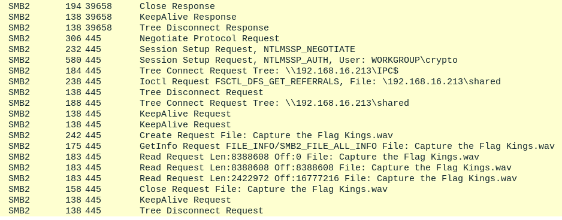
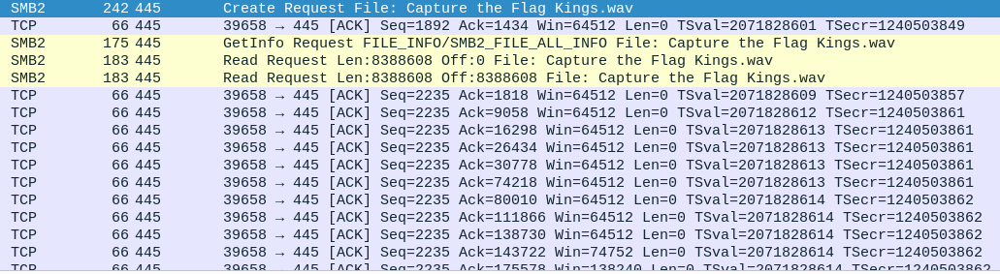
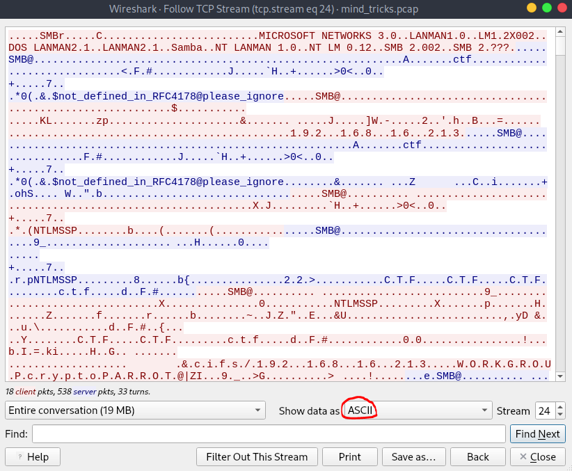
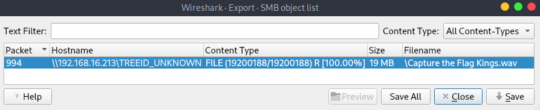
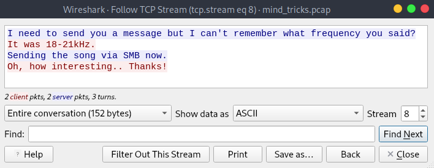
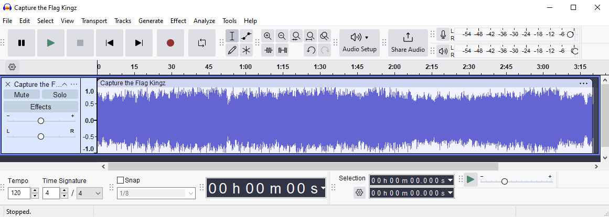
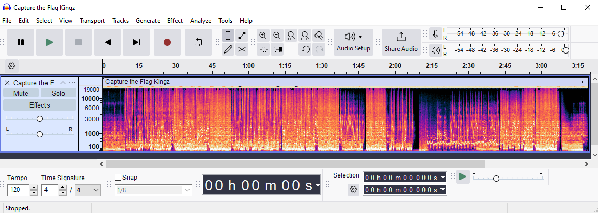
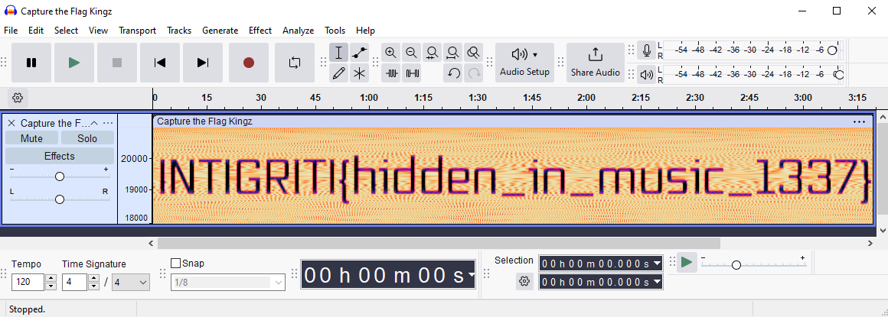

# CTF Mind Tricks

## Challenge Description

> There's an ongoing investigation into the communications of two potential hackers. As far as I can see, they only shared some music with each other but the feds are convinced something nefarious is going on. Let me know if you can find anything 🔎

## Solution

Players download a PCAP. There's a lot of noise from random HTTPS traffic, so they should filter by SMB and see this WAV file transfer.



Return to the start of the request, then follow the TCP stream.



You can convert the ASCII to raw and save this as a .MP4 file.



Alternatively, just go to `File > Export Objects > SMB`.



You'll find an AI song I generated with [suno](https://suno.com).

If you closed the PCAP here though, you missed a step! If you look through the ports (I recommend filtering out HTTP(S) with `!(tcp.port == 80 || tcp.port == 443)`), you'll a suspicious one; `1337`.





```
I need to send you a message but I can't remember what frequency you said?
It was 18-21kHz.
Sending the song via SMB now.
Oh, how interesting.. Thanks!
```



So, there's something hidden in some frequency of the audio 🤔 We can isolate these things with `sonic-visualizer` or `Audacity`. I went with the latter.



Viewing the spectrogram doesn't reveal anything.



We need to configure the range between `18000hz` to `21000hz`.



Flag: `INTIGRITI{hidden_in_music_1337}`
