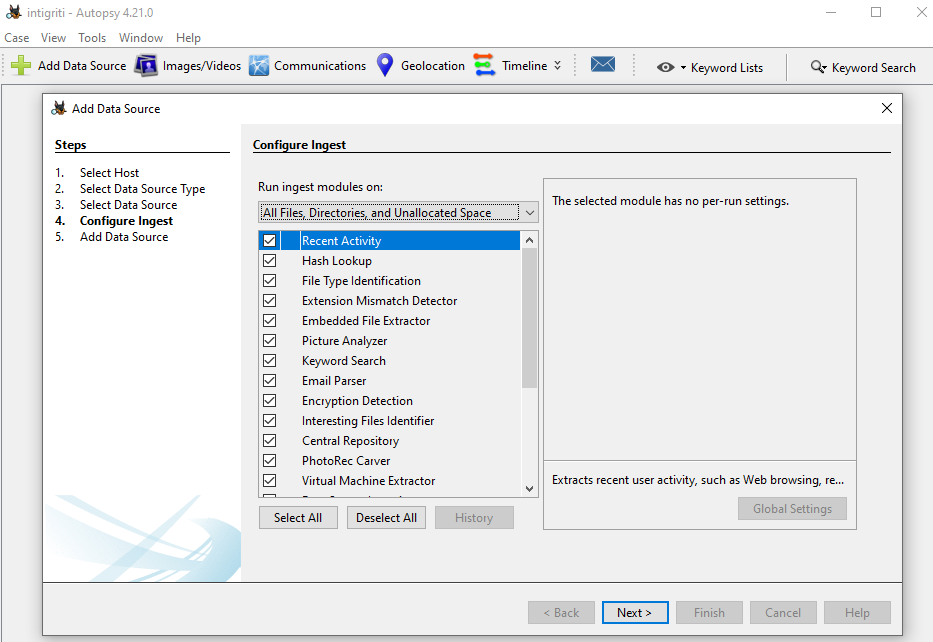
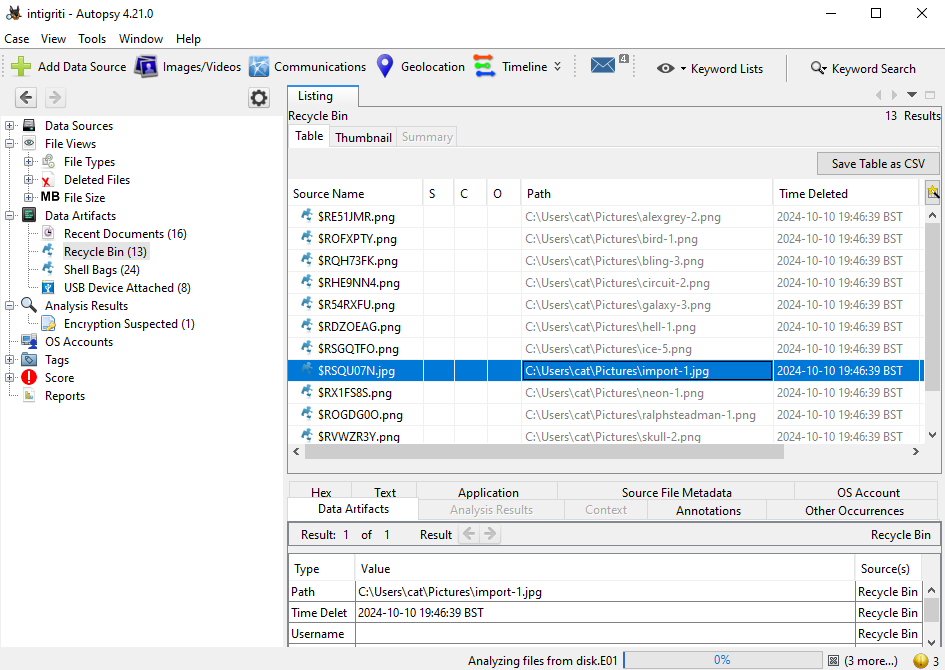
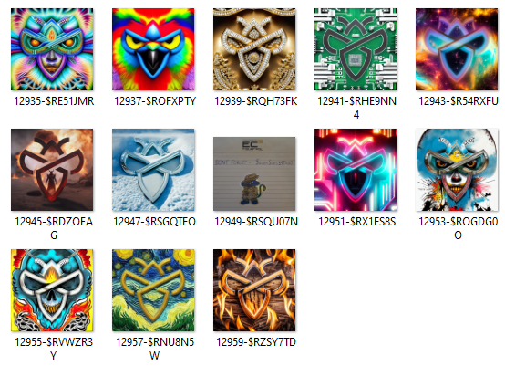
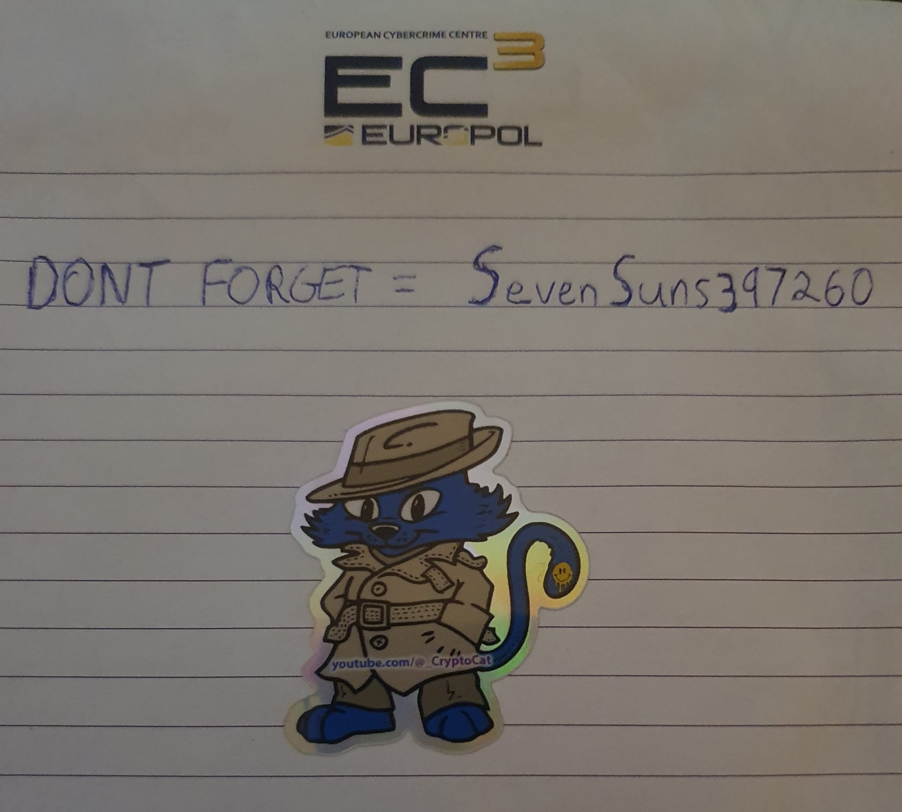
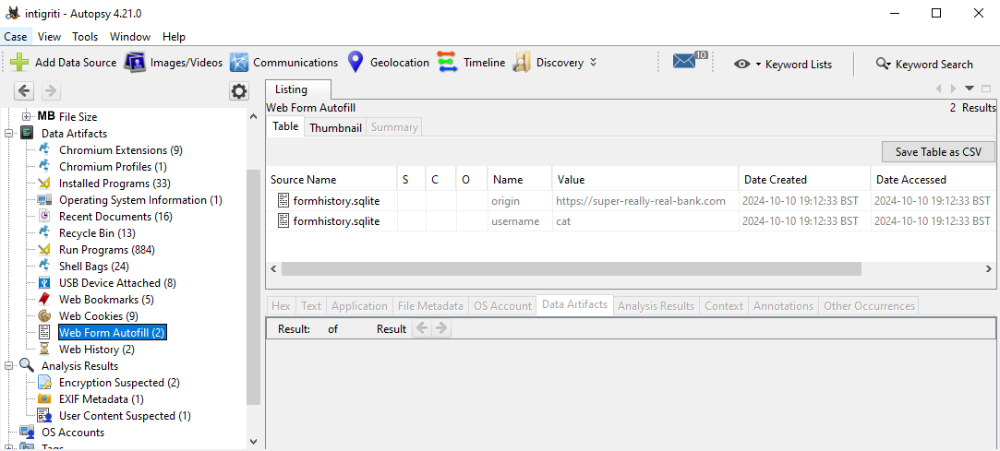

# Password Management

## Challenge Description

> My computer broke and I don't know what to do! Can you take a look at the drive? There shouldn't be any sensitive information on there, I deleted personal files a while ago..

## Solution

Players will download the disk image and analyse it with some forensics tool, e.g. `FTKImager` or `Autopsy`. I like [FTKImager](https://www.exterro.com/digital-forensics-software/ftk-imager) for file recovery but [Autopsy](https://www.autopsy.com/download) has some extra features to pull out interesting files, patterns, indicators etc.



Players will find 13 images that were deleted (and recycle bin emptied), but this doesn't erase them fully!



So, let's extract them.



12 of the images are AI generated, the last one is a photograph of a password: `SevenSuns397260`



Players can find reference of interesting website visit `https://super-really-real-bank.com` in the web data.



A bit of a hint that players should focus on browser history but it is encrypted!



```json
{
    "nextId": 2,
    "logins": [
        {
            "id": 1,
            "hostname": "https://super-really-real-bank.com",
            "httpRealm": null,
            "formSubmitURL": "",
            "usernameField": "",
            "passwordField": "",
            "encryptedUsername": "MDIEEPgAAAAAAAAAAAAAAAAAAAEwFAYIKoZIhvcNAwcECPe0E72Bq278BAiGUkKH0HzoSg==",
            "encryptedPassword": "MFoEEPgAAAAAAAAAAAAAAAAAAAEwFAYIKoZIhvcNAwcECNF/qseckS4/BDBYcrwEBJ5T2lxluEtiFPFfypt58TEfdDyZBaUN/7HFp4I02jsv/XKzazHG/NOHFNk=",
            "guid": "{c3899385-98e9-4900-b9de-1fabf67ed153}",
            "encType": 1,
            "timeCreated": 1728583953428,
            "timeLastUsed": 1728583953428,
            "timePasswordChanged": 1728583953428,
            "timesUsed": 1,
            "syncCounter": 1,
            "everSynced": false,
            "encryptedUnknownFields": "MDIEEPgAAAAAAAAAAAAAAAAAAAEwFAYIKoZIhvcNAwcECN2bf71w2iK/BAiWVos1I88Zqw=="
        }
    ],
    "potentiallyVulnerablePasswords": [],
    "dismissedBreachAlertsByLoginGUID": {},
    "version": 3
}
```



Let's extract the Firefox browser data! It's Windows, so the profiles will be stored at `C:\Users\cat\AppData\Roaming\Mozilla\Firefox\Profiles\`

We can use a tool like [firefox decrypt](https://github.com/unode/firefox_decrypt) to get some juicy passwords, cookies etc (providing we have the master password).

Players use the password they found earlier to unlock the data (`SevenSuns397260`), then in the cookies/saved passwords will be the flag 😼



```bash
python firefox_decrypt.py /home/crystal/Desktop/pass_management/profile/

Master Password for profile /home/crystal/Desktop/pass_management/profile/:

Website:   https://super-really-real-bank.com
Username: 'cat'
Password: 'INTIGRITI{4n_unf0r7un473_53r135_0f_m1574k35}'
```



Flag: `INTIGRITI{4n_unf0r7un473_53r135_0f_m1574k35}`

BTW sorry the image was so big! I actually tried to make this with Windows 10, Windows 7, and Windows XP and ran into different issues each time. I tried to clear up as many files as possible and compress etc but could never get it under 5gb lol. My first time making this kind of forensics challenge so if anyone has any tips for future, let me know!
