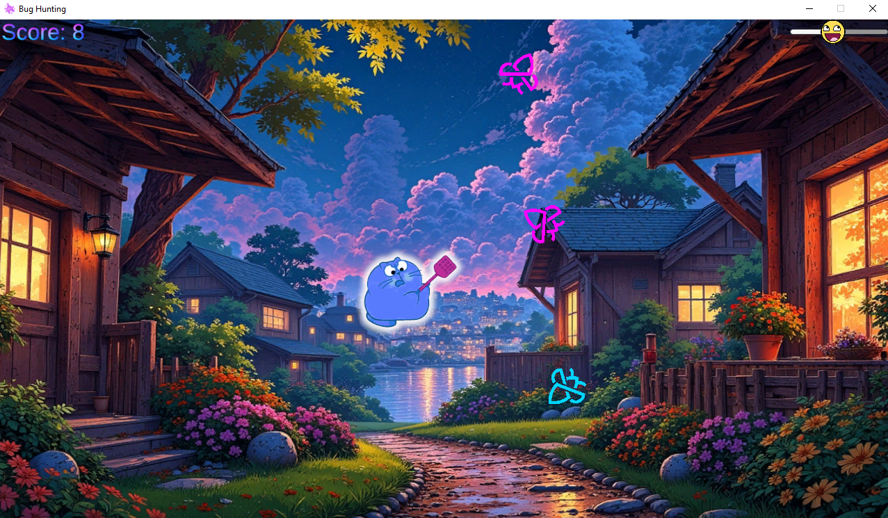
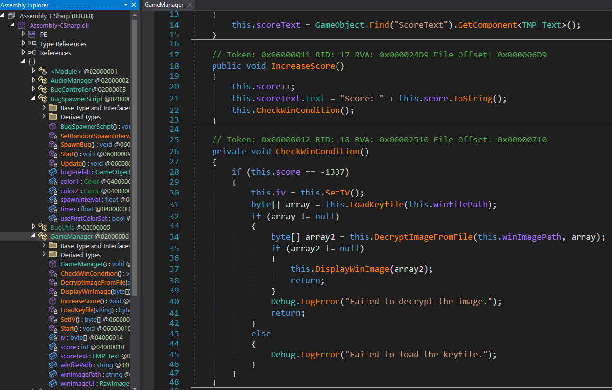
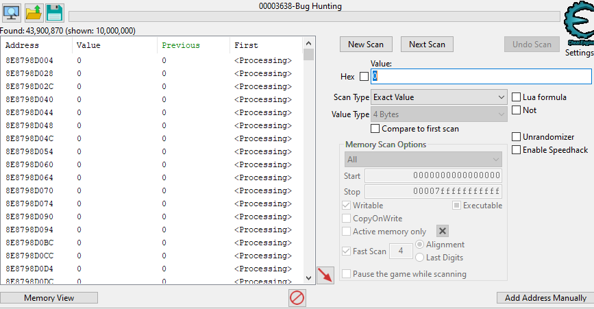
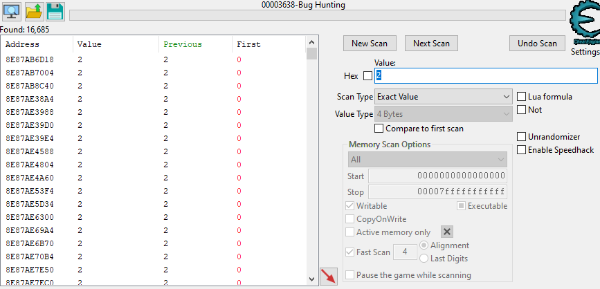
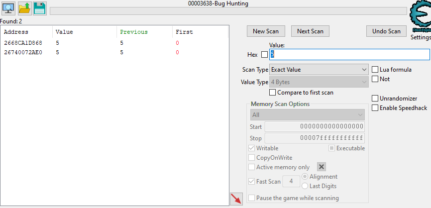
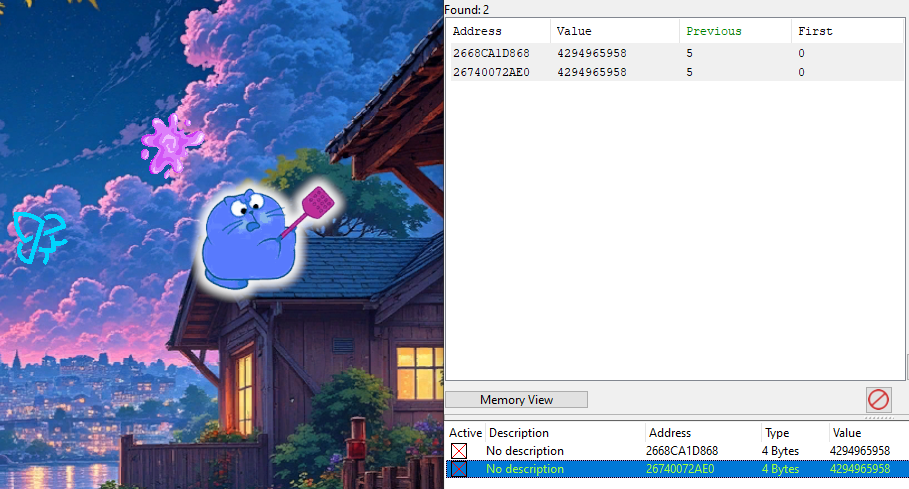
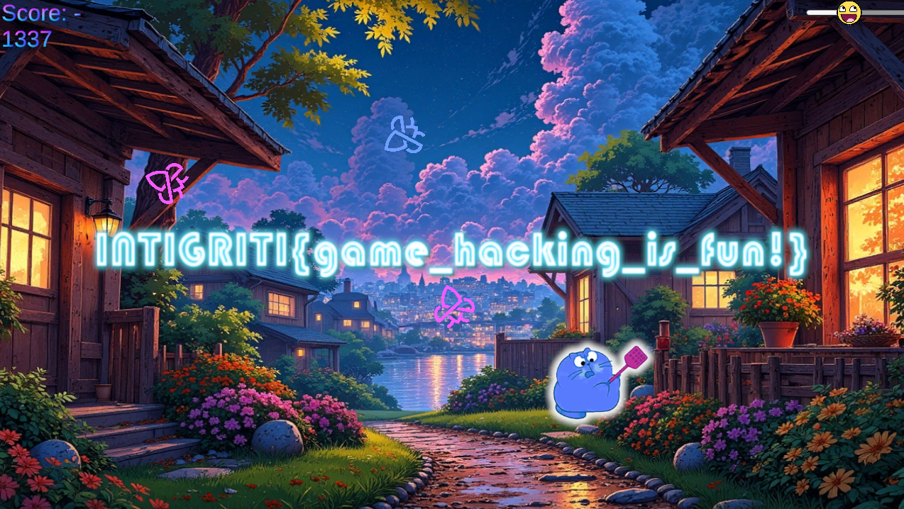

# Bug Squash (part 1)

## Video walkthrough

## Challenge Description

> Squash those bugs!

## Solution

When players open the game, they'll find they can squash bugs to earn points.

There's no clear indication what the win condition is, so we'll need to reverse it. Since it's a Unity game compiled with Mono, we can decompile with a tool like `dnSpy`. We'll quickly find the win condition; the score must hit `-1337`

That's not possible! So here's where the hacking comes in 😈 There are at least three different solutions here.

1. Patch the code in dnSpy (e.g. set win condition to be `this.score == 0`)
2. Extract the encrypted flag image and reverse the code further to recover the AES key and obfuscated IV
3. Use cheat engine to modify the score in memory

Options 1 and 3 are probably the easiest, and are the ones I show in the [walkthrough video](https://youtu.be/VoT74JOGWgA). Let's go with cheat engine this time! We can attach it to the game process and search for the value `0` in memory (our initial score).

There's 44 million results, and we don't know which one is our score so let's narrow it down. We score a couple of points and then change the value to `2` and click `Next Scan` in cheat engine.

We narrowed it down to 16k results, let's repeat the process until we have a reasonable amount. We don't want too many because some could be important, leading to game/system crash when we modify the value.

Add the results to the address table and freeze them (optional) and change the value to `-1338` (we need to score a point for the win condition to be checked again).

Now, just return to the game and squash a bug.

Flag: `INTIGRITI{game_hacking_is_fun!}`

Hope you enjoyed this one! I made most of the graphics and music with AI 😎
