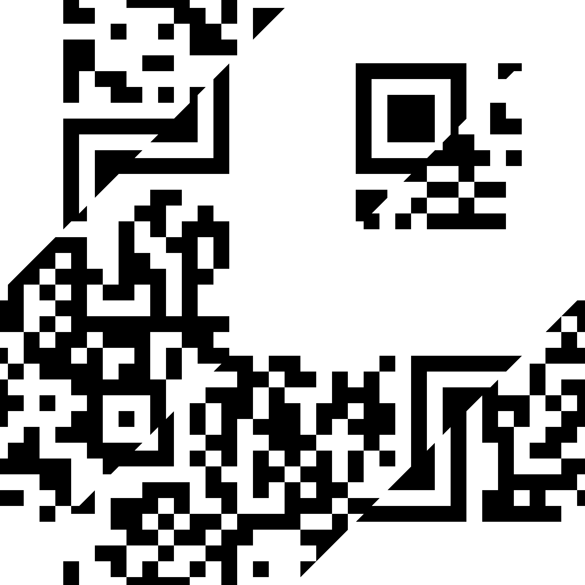

# Quick Recovery

## Challenge Description

> Hey, check this QR code ASAP! It's highly sensitive so I scrambled it but you shouldn't have a hard time reconstructing - just make sure to update the `a_order` to our shared PIN. The `b_order` is the reverse of that 😉

## Solution

Players receive a jumbled up QR code, and the script used to generate it.



### gen.py


```python
from PIL import Image, ImageDraw
from itertools import permutations
import subprocess

qr_code_image = Image.open("qr_code.png")
width, height = qr_code_image.size
half_width, half_height = width // 2, height // 2

squares = {
    "1": (0, 0, half_width, half_height),
    "2": (half_width, 0, width, half_height),
    "3": (0, half_height, half_width, height),
    "4": (half_width, half_height, width, height)
}


def split_square_into_triangles(img, box):
    x0, y0, x1, y1 = box
    a_triangle_points = [(x0, y0), (x1, y0), (x0, y1)]
    b_triangle_points = [(x1, y1), (x1, y0), (x0, y1)]

    def crop_triangle(points):
        mask = Image.new("L", img.size, 0)
        draw = ImageDraw.Draw(mask)
        draw.polygon(points, fill=255)
        triangle_img = Image.new("RGBA", img.size)
        triangle_img.paste(img, (0, 0), mask)
        return triangle_img.crop((x0, y0, x1, y1))

    return crop_triangle(a_triangle_points), crop_triangle(b_triangle_points)


triangle_images = {}
for key, box in squares.items():
    triangle_images[f"{key}a"], triangle_images[f"{key}b"] = split_square_into_triangles(
        qr_code_image, box)

a_order = ["1", "2", "3", "4"]  # UPDATE ME
b_order = ["1", "2", "3", "4"]  # UPDATE ME

final_positions = [
    (0, 0),
    (half_width, 0),
    (0, half_height),
    (half_width, half_height)
]

reconstructed_image = Image.new("RGBA", qr_code_image.size)

for i in range(4):
    a_triangle = triangle_images[f"{a_order[i]}a"]
    b_triangle = triangle_images[f"{b_order[i]}b"]
    combined_square = Image.new("RGBA", (half_width, half_height))
    combined_square.paste(a_triangle, (0, 0))
    combined_square.paste(b_triangle, (0, 0), b_triangle)
    reconstructed_image.paste(combined_square, final_positions[i])

reconstructed_image.save("obscured.png")
print("Reconstructed QR code saved as 'obscured.png'")
```


They simply need to make an opposing script to reconstruct it. Since they don't know the PIN, they can try all possible combinations (24) and see which produce valid QRs. The whole process can be automated to a single script.

### solve.py


```python
from PIL import Image, ImageDraw
from itertools import permutations
import subprocess

# Load the rearranged QR code image
rearranged_image = Image.open("obscured.png")

# Assuming the QR code is a square, get the dimensions
width, height = rearranged_image.size
half_width, half_height = width // 2, height // 2

# Define the bounding boxes for the four main squares in natural order
squares = {
    "1": (0, 0, half_width, half_height),                     # Top-left
    "2": (half_width, 0, width, half_height),                 # Top-right
    "3": (0, half_height, half_width, height),                # Bottom-left
    "4": (half_width, half_height, width, height)             # Bottom-right
}

# Function to split a square into two triangles
def split_square_into_triangles(img, box):
    x0, y0, x1, y1 = box
    # Define the points for the triangles
    a_triangle_points = [(x0, y0), (x1, y0), (x0, y1)]  # Top-left triangle
    b_triangle_points = [(x1, y1), (x1, y0), (x0, y1)]  # Bottom-right triangle

    # Crop and mask each triangle
    def crop_triangle(points):
        mask = Image.new("L", img.size, 0)
        draw = ImageDraw.Draw(mask)
        draw.polygon(points, fill=255)
        triangle_img = Image.new("RGBA", img.size)
        triangle_img.paste(img, (0, 0), mask)
        return triangle_img.crop((x0, y0, x1, y1))

    return crop_triangle(a_triangle_points), crop_triangle(b_triangle_points)

# Split each square into two triangles and store them
triangle_images = {}
for key, box in squares.items():
    triangle_images[f"{key}a"], triangle_images[f"{key}b"] = split_square_into_triangles(
        rearranged_image, box)

# Define the positions for the 4 quadrants
original_positions = [
    (0, 0),                     # Top-left
    (half_width, 0),            # Top-right
    (0, half_height),           # Bottom-left
    (half_width, half_height)   # Bottom-right
]

# Brute-force through all permutations of a_order
for a_order in permutations(["1", "2", "3", "4"]):
    # Set b_order as the reverse of a_order
    b_order = a_order[::-1]

    # Create a new blank image for each permutation
    original_image = Image.new("RGBA", rearranged_image.size)

    # Assemble the image based on a_order and b_order
    for i in range(4):
        a_triangle = triangle_images[f"{a_order[i]}a"]
        b_triangle = triangle_images[f"{b_order[i]}b"]

        # Combine triangles in a new square
        combined_square = Image.new("RGBA", (half_width, half_height))
        combined_square.paste(a_triangle, (0, 0))
        combined_square.paste(b_triangle, (0, 0), b_triangle)

        # Paste the combined square into the original image
        original_image.paste(combined_square, original_positions[i])

    # Save the reconstructed image
    original_image.save("temp_original.png")

    # Run zbarimg on the saved image to try decoding it
    result = subprocess.run(
        ["zbarimg", "temp_original.png"], capture_output=True, text=True)
    output = result.stdout.strip()

    # Check if zbarimg returned a valid QR code output
    if output:
        print(f"Decoded QR code with a_order {a_order} and b_order {b_order}:")
        print(output)
        break  # Stop after finding the first valid QR code
else:
    print("No readable QR code found in any permutation.")
```


Run it and get the flag!


```bash
python solve.py
Decoded QR code with a_order ('2', '4', '1', '3') and b_order ('3', '1', '4', '2'):
QR-Code:INTIGRITI{7h475_h0w_y0u_r3c0n57ruc7_qr_c0d3}
```


Flag: `INTIGRITI{7h475_h0w_y0u_r3c0n57ruc7_qr_c0d3}`
