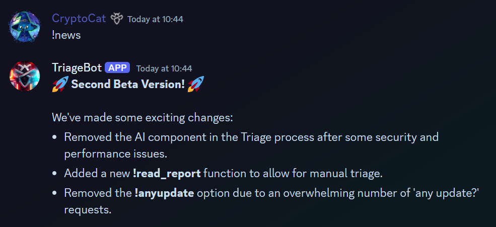
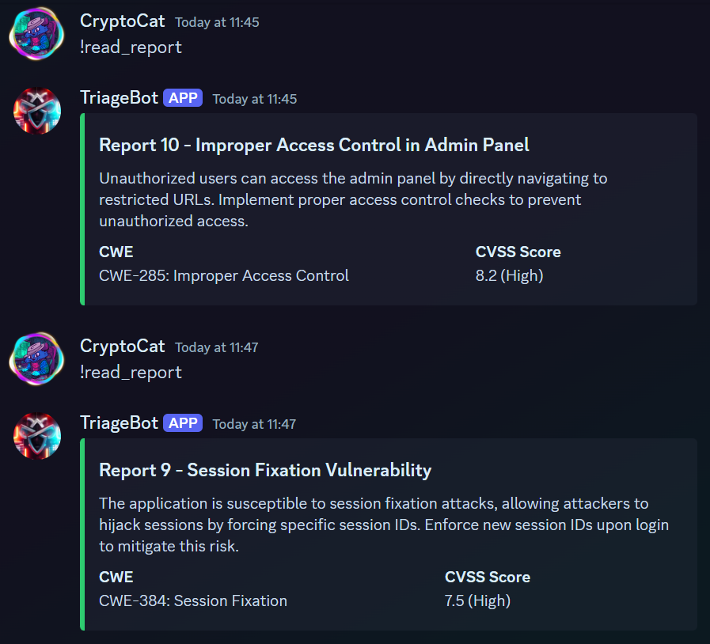
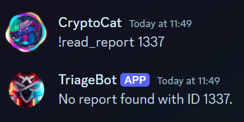
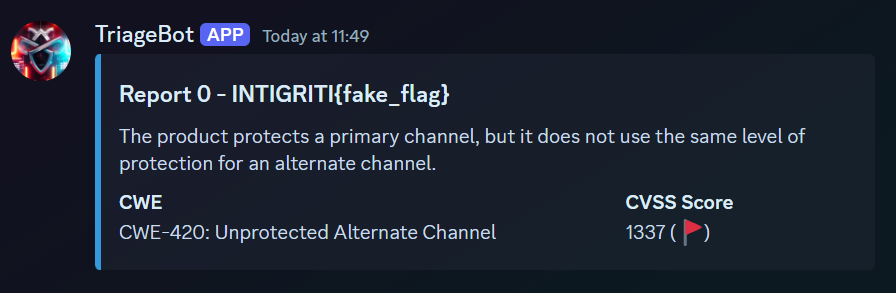

# Triage Bot v2

## Challenge Description

> Check out our new and improved Triage Bot!

The 2023 1337UP LIVE CTF featured a `TriageBot` challenge that used an LLM (ChatGPT) to triage reports. Players had to force the bot to leak it's initial prompt (against it's instructions). If you missed it, check out the [video walkthrough](https://www.youtube.com/watch?v=5wcJjNgncOQ).

## Solution

This years challenge is a lot easier than last years, partially because common feedback in both of the previous CTFs was "not enough beginner challenges". Another reason for the simplicity of this challenge solution is we were concerned about the [security of our discord server](https://hanasuru.medium.com/how-we-found-unintended-bypass-to-exploiting-entire-cyberthreatforce-discord-server-d93951b9efab) and opted to play it safe 😂

Here's the help menu for the discord bot.

According to the `!news` command, there's a new `!read_report` command.

However, we lack the permissions to use it 🤔

Let's try the rest of the commands.

Not much functionality, apart from the cool AI generated images 😎

We need the `triage` role! We won't be able to give ourselves that role in the intigriti discord server. So we need to invite the bot to our own server, where we can assign ourselves the role.

Now, we can read reports.

It appears to give a random one each time. What if we specify an ID?

Interesting! How about ID `0`?

We have the flag!

Flag: `INTIGRITI{4n07h3r_y34r_4n07h3r_7r1463_b07}`
