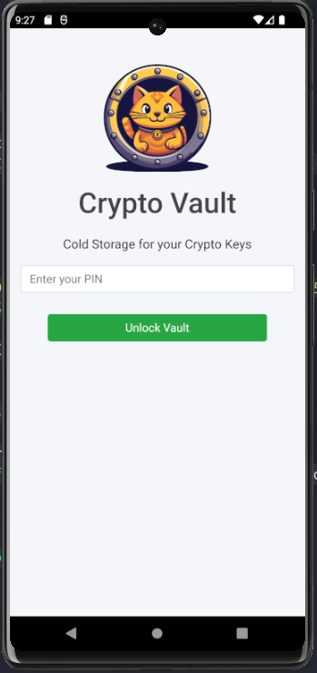
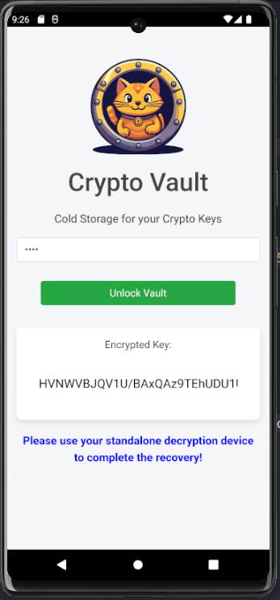
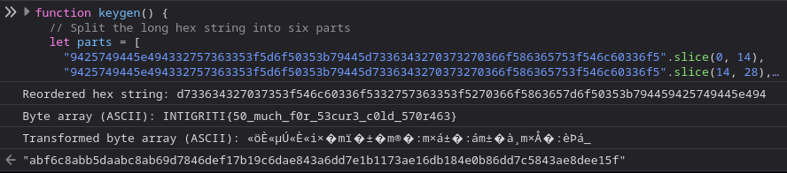

# Cold Storage

## Challenge Description

> People say you should store your keys offline in cold storage, so I built this offline app! I think that's what cold storage means 🤔

## Solution

Open the mobile app with `android-studio` or `GenyMotion` or w/e and you'll find a crypto cold storage wallet that requires a pin.



Now is the time to decompile the APK with a tool like `jadx-gui` (maybe you did this first).

You will find it is a [cordova app](https://cordova.apache.org) and in the `index.html` is the pin, simplez!



```js
function unlockVault() {
    var pin = document.getElementById("pin").value.trim();
    if (pin === "7331") {
        document.getElementById("message").innerText = "Correct PIN!";
        document.getElementById("message").style.color = "green";
        document.getElementById("keyList").style.display = "block";
        retrieveencryptedKey();
    } else {
        document.getElementById("message").innerText = "Invalid PIN!";
        document.getElementById("message").style.color = "red";
        document.getElementById("keyList").style.display = "none";
    }
}
```



It retrieves the encrypted key.



```js
function retrieveencryptedKey() {
    var keyInput = document.getElementById("encryptedKey");
    var encryptedKey = keygen();
    keyInput.value = encryptedKey;
    document.getElementById("message").innerText = "Please use your standalone decryption device to complete the recovery!";
    document.getElementById("message").style.color = "blue";
}
```



It looks something like this (the UI and encrypted format changed a bit but I cba booting `android-studio` in my VM lol).



But that's no use, we want the decrypted key! Lets check the `keygen()` function.



```js
(function (_0x506dbf, _0x170411) {
    const _0x12e004 = a0_0x1707,
        _0x3fbe25 = _0x506dbf();
    while (!![]) {
        try {
            const _0x3b5636 =
                (parseInt(_0x12e004(0x122)) / 0x1) * (parseInt(_0x12e004(0x117)) / 0x2) +
                (-parseInt(_0x12e004(0x111)) / 0x3) * (-parseInt(_0x12e004(0x121)) / 0x4) +
                (-parseInt(_0x12e004(0x11b)) / 0x5) * (parseInt(_0x12e004(0x11f)) / 0x6) +
                (parseInt(_0x12e004(0x113)) / 0x7) * (-parseInt(_0x12e004(0x11d)) / 0x8) +
                (parseInt(_0x12e004(0x125)) / 0x9) * (parseInt(_0x12e004(0x11e)) / 0xa) +
                -parseInt(_0x12e004(0x123)) / 0xb +
                (parseInt(_0x12e004(0x120)) / 0xc) * (parseInt(_0x12e004(0x112)) / 0xd);
            if (_0x3b5636 === _0x170411) break;
            else _0x3fbe25["push"](_0x3fbe25["shift"]());
        } catch (_0x18c02d) {
            _0x3fbe25["push"](_0x3fbe25["shift"]());
        }
    }
})(a0_0x32dd, 0x4ff3a);
function a0_0x32dd() {
    const _0xb65be8 = [
        "9425749445e494332757363353f5d6f50353b79445d7336343270373270366f586365753f546c60336f5",
        "length",
        "map",
        "38495LKnOYO",
        "substr",
        "8lZAZpw",
        "6486450oYKfNK",
        "402RerQLO",
        "12MNesgS",
        "4FulGyI",
        "528939ZPevpd",
        "861608xHrljL",
        "split",
        "9gQnkOh",
        "toString",
        "242571ENkSLa",
        "502515FcoXSF",
        "2628171KytvIJ",
        "push",
        "slice",
        "join",
        "2HiwuOL",
    ];
    a0_0x32dd = function () {
        return _0xb65be8;
    };
    return a0_0x32dd();
}
function affineEncrypt(_0x1930bc, _0x36e79b, _0x33477e) {
    return (_0x36e79b * _0x1930bc + _0x33477e) % 0x100;
}
function xor(_0x3a38fa, _0x3c3309) {
    return _0x3a38fa ^ _0x3c3309;
}
function a0_0x1707(_0x3d4d4c, _0x35b685) {
    const _0x32dd9d = a0_0x32dd();
    return (
        (a0_0x1707 = function (_0x170770, _0x4c15fe) {
            _0x170770 = _0x170770 - 0x110;
            let _0x3e6dad = _0x32dd9d[_0x170770];
            return _0x3e6dad;
        }),
        a0_0x1707(_0x3d4d4c, _0x35b685)
    );
}
function hexToBytes(_0x1d9eb0) {
    const _0x3e7222 = a0_0x1707;
    let _0x2ac99a = [];
    for (let _0x2363dc = 0x0; _0x2363dc < _0x1d9eb0[_0x3e7222(0x119)]; _0x2363dc += 0x2) {
        _0x2ac99a[_0x3e7222(0x114)](parseInt(_0x1d9eb0[_0x3e7222(0x11c)](_0x2363dc, 0x2), 0x10));
    }
    return _0x2ac99a;
}
function reverseString(_0x22dcba) {
    const _0x102ddd = a0_0x1707;
    return _0x22dcba[_0x102ddd(0x124)]("")["reverse"]()[_0x102ddd(0x116)]("");
}
function keygen() {
    const _0x588caa = a0_0x1707;
    let _0x620410 = _0x588caa(0x118),
        _0x19eb60 = [
            _0x620410[_0x588caa(0x115)](0x0, 0xe),
            _0x620410[_0x588caa(0x115)](0xe, 0x1c),
            _0x620410[_0x588caa(0x115)](0x1c, 0x2a),
            _0x620410[_0x588caa(0x115)](0x2a, 0x38),
            _0x620410["slice"](0x38, 0x46),
            _0x620410[_0x588caa(0x115)](0x46, 0x54),
        ],
        _0x4c2f5e = [_0x19eb60[0x3], _0x19eb60[0x5], _0x19eb60[0x1], _0x19eb60[0x4], _0x19eb60[0x2], _0x19eb60[0x0]],
        _0x22e526 = reverseString(_0x4c2f5e["join"]("")),
        _0x2051e9 = hexToBytes(_0x22e526),
        _0x3788f1 = 0x9,
        _0x2afabe = 0x7,
        _0x56285d = 0x33,
        _0x351569 = _0x2051e9["map"]((_0x585a6f) => xor(affineEncrypt(_0x585a6f, _0x3788f1, _0x2afabe), _0x56285d));
    return _0x351569[_0x588caa(0x11a)]((_0x5ca89b) => ("0" + _0x5ca89b[_0x588caa(0x110)](0x10))[_0x588caa(0x115)](-0x2))[_0x588caa(0x116)]("");
}
```



Ewww.. obfuscation 🤮 There's a lot of approaches here. You might try to manually reverse, or throw it into some de-obfuscation tool 🤔

You could also paste it into the console, then just run `keygen()`. It will give us `abf6c8abb5daabc8ab69d7846def17b19c6dae843a6dd7e1b1173ae16db184e0b86dd7c5843ae8dee15f` again, but with some breakpoints you can trace through the logic.

Maybe you focus on values you can see in the original code, e.g. what is `9425749445e494332757363353f5d6f50353b79445d7336343270373270366f586365753f546c60336f5` when unhexed? Unfortunately, not plaintext!

Let's [deobfuscate](https://obf-io.deobfuscate.io).



```js
function affineEncrypt(_0x1930bc, _0x36e79b, _0x33477e) {
    return (_0x36e79b * _0x1930bc + _0x33477e) % 0x100;
}
function xor(_0x3a38fa, _0x3c3309) {
    return _0x3a38fa ^ _0x3c3309;
}
function hexToBytes(_0x1d9eb0) {
    let _0x2ac99a = [];
    for (let _0x2363dc = 0x0; _0x2363dc < _0x1d9eb0.length; _0x2363dc += 0x2) {
        _0x2ac99a.push(parseInt(_0x1d9eb0.substr(_0x2363dc, 0x2), 0x10));
    }
    return _0x2ac99a;
}
function reverseString(_0x22dcba) {
    return _0x22dcba.split("").reverse().join("");
}
function keygen() {
    let _0x19eb60 = [
        "9425749445e494332757363353f5d6f50353b79445d7336343270373270366f586365753f546c60336f5".slice(0x0, 0xe),
        "9425749445e494332757363353f5d6f50353b79445d7336343270373270366f586365753f546c60336f5".slice(0xe, 0x1c),
        "9425749445e494332757363353f5d6f50353b79445d7336343270373270366f586365753f546c60336f5".slice(0x1c, 0x2a),
        "9425749445e494332757363353f5d6f50353b79445d7336343270373270366f586365753f546c60336f5".slice(0x2a, 0x38),
        "9425749445e494332757363353f5d6f50353b79445d7336343270373270366f586365753f546c60336f5".slice(0x38, 0x46),
        "9425749445e494332757363353f5d6f50353b79445d7336343270373270366f586365753f546c60336f5".slice(0x46, 0x54),
    ];
    let _0x4c2f5e = [_0x19eb60[0x3], _0x19eb60[0x5], _0x19eb60[0x1], _0x19eb60[0x4], _0x19eb60[0x2], _0x19eb60[0x0]];
    let _0x22e526 = _0x4c2f5e.join("").split("").reverse().join("");
    let _0x2051e9 = hexToBytes(_0x22e526);
    let _0x351569 = _0x2051e9.map((_0x585a6f) => (0x9 * _0x585a6f + 0x7) % 0x100 ^ 0x33);
    return _0x351569.map((_0x5ca89b) => ("0" + _0x5ca89b.toString(0x10)).slice(-0x2)).join("");
}
```



Much better! I'll also ask ChatGPT to further deobfuscate, including variable renaming, comments etc.



```js
// Function to perform Affine encryption on a single byte
function affineEncrypt(inputByte, multiplier, increment) {
    return (multiplier * inputByte + increment) % 256;
}

function xor(byte1, byte2) {
    return byte1 ^ byte2;
}

function hexToBytes(hexString) {
    let byteArray = [];
    // Loop through the hex string, two characters at a time
    for (let i = 0; i < hexString.length; i += 2) {
        // Convert each pair of hex characters to a byte and add to the array
        byteArray.push(parseInt(hexString.substr(i, 2), 16));
    }
    return byteArray;
}

function reverseString(str) {
    return str.split("").reverse().join("");
}

function keygen() {
    // Split the long hex string into six parts
    let parts = [
        "9425749445e494332757363353f5d6f50353b79445d7336343270373270366f586365753f546c60336f5".slice(0, 14),
        "9425749445e494332757363353f5d6f50353b79445d7336343270373270366f586365753f546c60336f5".slice(14, 28),
        "9425749445e494332757363353f5d6f50353b79445d7336343270373270366f586365753f546c60336f5".slice(28, 42),
        "9425749445e494332757363353f5d6f50353b79445d7336343270373270366f586365753f546c60336f5".slice(42, 56),
        "9425749445e494332757363353f5d6f50353b79445d7336343270373270366f586365753f546c60336f5".slice(56, 70),
        "9425749445e494332757363353f5d6f50353b79445d7336343270373270366f586365753f546c60336f5".slice(70, 84),
    ];
    // Reorder parts and join them into a single string
    let reordered = [parts[3], parts[5], parts[1], parts[4], parts[2], parts[0]].join("");
    // Reverse the string and convert it to bytes
    let byteArray = hexToBytes(reverseString(reordered));
    // Apply affine transformation and XOR to each byte
    let transformedArray = byteArray.map((byte) => (9 * byte + 7) % 256 ^ 0x33);
    // Convert the transformed bytes back to a hex string
    return transformedArray.map((byte) => ("0" + byte.toString(16)).slice(-2)).join("");
}
```



We can paste that into the devtools console and print out each step.



```js
let reordered = [parts[3], parts[5], parts[1], parts[4], parts[2], parts[0]].join("");
console.log(reordered);
let byteArray = hexToBytes(reverseString(reordered));
console.log(byteArray);
let transformedArray = byteArray.map((byte) => (9 * byte + 7) % 256 ^ 0x33);
console.log(transformedArray);

return transformedArray.map((byte) => ("0" + byte.toString(16)).slice(-2)).join("");
```



This time, we get some new values.


Hex decoding `d733634327037353f546c60336f5332757363353f5270366f5863657d6f50353b794459425749445e494` produces garbage.

Alright, let's convert the other arrays to ASCII.



```js
function keygen() {
    // Split the long hex string into six parts
    let parts = [
        "9425749445e494332757363353f5d6f50353b79445d7336343270373270366f586365753f546c60336f5".slice(0, 14),
        "9425749445e494332757363353f5d6f50353b79445d7336343270373270366f586365753f546c60336f5".slice(14, 28),
        "9425749445e494332757363353f5d6f50353b79445d7336343270373270366f586365753f546c60336f5".slice(28, 42),
        "9425749445e494332757363353f5d6f50353b79445d7336343270373270366f586365753f546c60336f5".slice(42, 56),
        "9425749445e494332757363353f5d6f50353b79445d7336343270373270366f586365753f546c60336f5".slice(56, 70),
        "9425749445e494332757363353f5d6f50353b79445d7336343270373270366f586365753f546c60336f5".slice(70, 84),
    ];

    // Reorder parts and join them into a single string
    let reordered = [parts[3], parts[5], parts[1], parts[4], parts[2], parts[0]].join("");
    console.log("Reordered hex string:", reordered);

    // Convert reordered and reversed hex string to bytes
    let byteArray = hexToBytes(reverseString(reordered));
    console.log("Byte array (ASCII):", byteArray.map((byte) => String.fromCharCode(byte)).join(""));

    // Apply affine transformation and XOR to each byte
    let transformedArray = byteArray.map((byte) => (9 * byte + 7) % 256 ^ 0x33);
    console.log("Transformed byte array (ASCII):", transformedArray.map((byte) => String.fromCharCode(byte)).join(""));

    // Return the transformed bytes as a hex string
    return transformedArray.map((byte) => ("0" + byte.toString(16)).slice(-2)).join("");
}

// Call the keygen function
keygen();
```



We get our flag!



Flag: `INTIGRITI{50_much_f0r_53cur3_c0ld_570r463}`
