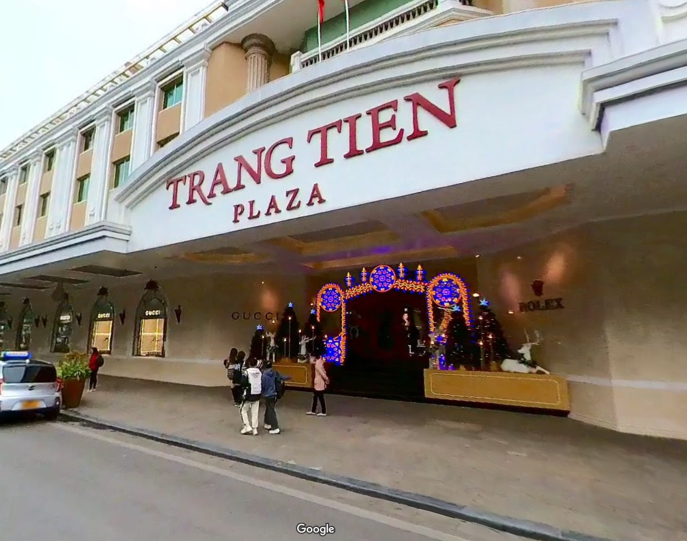
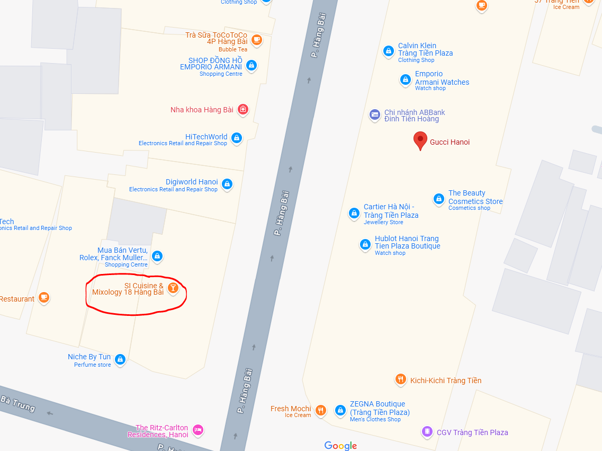
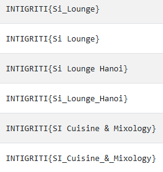

# Trackdown

## Challenge Description

> There's a fugitive on the loose and we need to track him down! He posted this to social media recently, do you know where he took the photograph from? If you can provide the precise building, we can move in 🚔

## Solution

Players receive the following image.

An obvious approach is to search for `Gucci, Trang Tien Plaza` on [Google Maps](https://maps.app.goo.gl/EZP5Fpi9GM139uuR8). Check the street view to find the same angle.

Now, spin around and what do we see?

If you look closely, you can see the same seating/tables. Let's check the map..

There we go! We find the [correct location](https://maps.app.goo.gl/nyvSVbDtRJYejKZh7). That was an easy one 😁 Terrible, rip-off bar BTW - do not recommend. There's an amazing place round the corner that does a _delicious_ pho cocktail 😋

Flag: `INTIGRITI{Si_Lounge_Hanoi}`

We allowed several variations of the location, not case-sensitive:

Note, a lot of people confused `what the photo is of` and `where the photo was taken from`.
