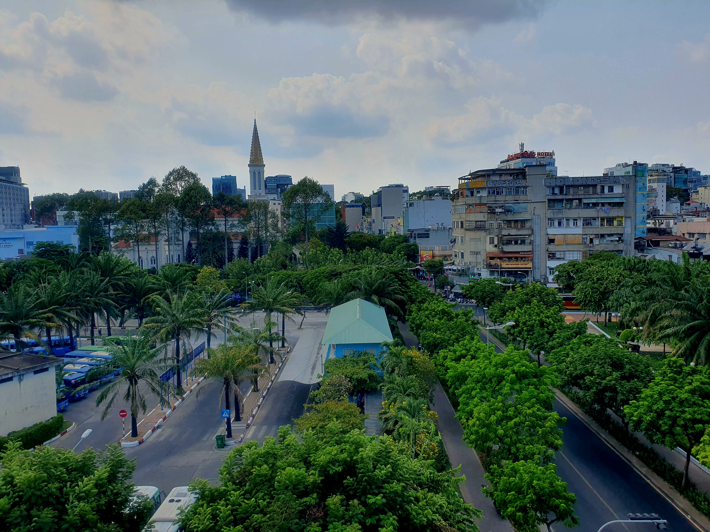
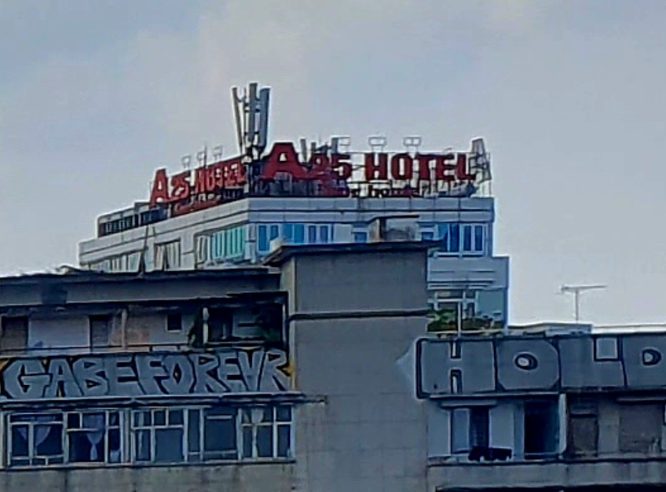
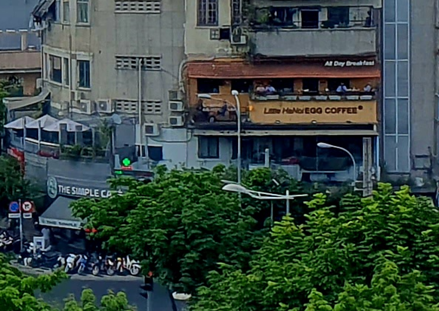
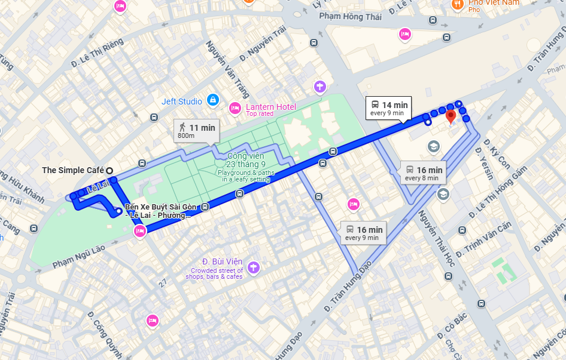
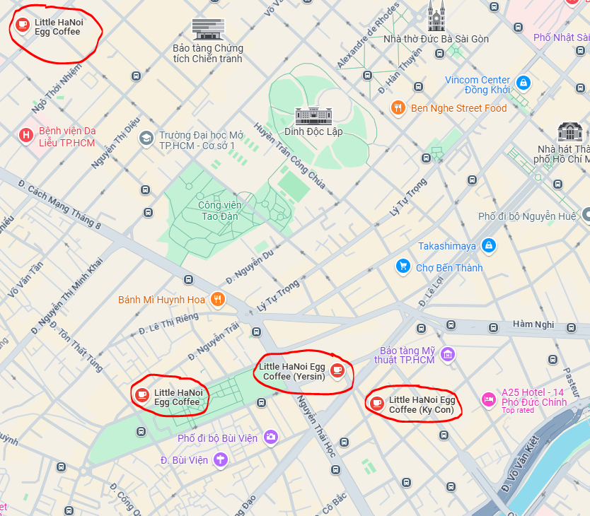
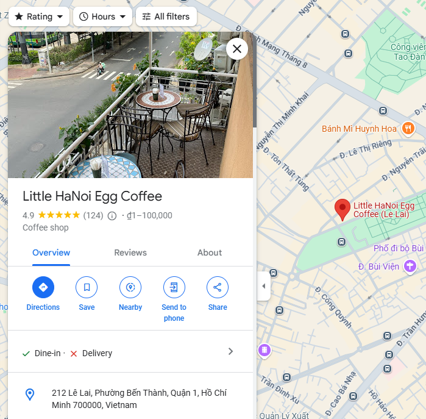
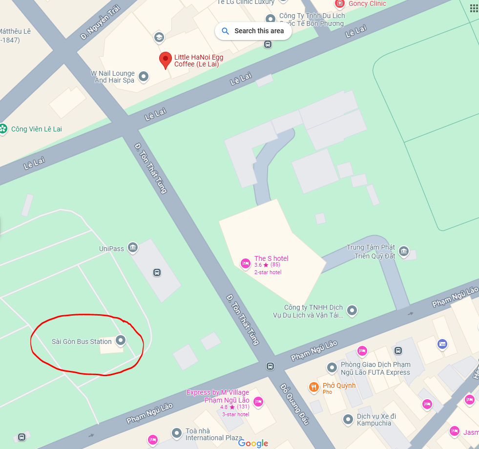
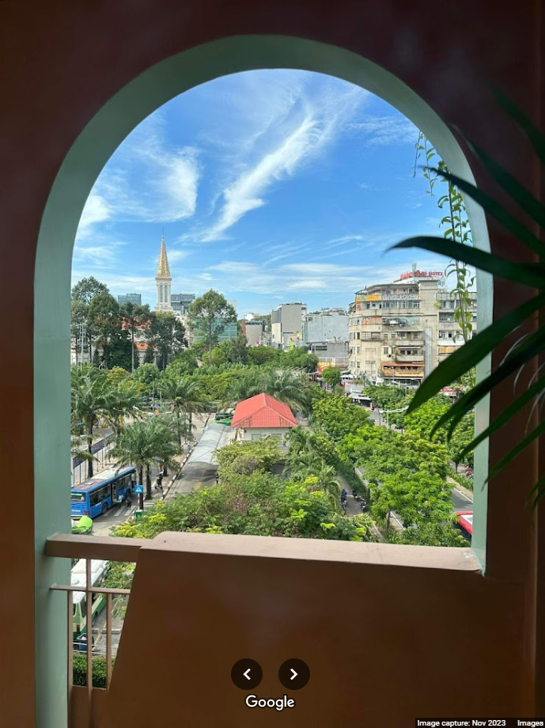
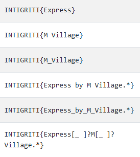
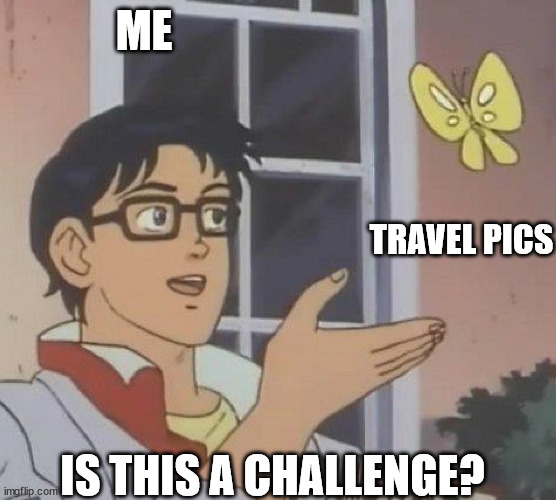

# Trackdown 2

## Challenge Description

> We didn't get him in time 😫 Thankfully, we don't believe he's fled the country yet. He uploaded another photo this morning, it's as if he's taunting us! Anyway, this may be our last chance - do you know where he is?

## Solution

Players receive the following image.

A bit harder than the last one, but there's a few approaches. You want to zoom in and look for anything with text, that you can search for on Google Maps. How about the `A25 HOTEL`?

Alternatively, could go for `Little HaNoi EGG COFFEE` or `THE SIMPLE CAFE`.

I'm sure you can find plenty more! We just want to get the general area, I'll try `Little HaNoi EGG COFFEE` (I was going to post a pic taken from that balcony, but I think it was too hard to pinpoint from the view).

Unfortunately, there are a lot of results (it's a chain, albeit a small one) so let's start with [the default](https://maps.app.goo.gl/e2aftjBVh55WyGfa8) and look for a nearby `A25 Hotel`.

Oh dear, there are a lot! The red arrow is the location of the `Litle HaNoi EGG COFFEE`.

Let's check for `SIMPLE CAFE`.

Nope, there should be one right next to the Egg Coffee shop! Some other ways we could verify this would be checking the satellite and street view imagery _or_ looking through the pictures of the coffee shop on Google Maps (there should be some of that nice balcony).

OK, let's revise our approach. I'll search for `little hanoi egg coffee` without moving the map.

We could check all 3 (already checked `Yersin`) but let's think smart 🧠 When we looked for directions to the `SIMPLE CAFE` it was an 11 minute walk away and _right next to_ the `Little Hanoi Egg Coffee` you see to the left of the `Yersin` store.

We [check it](https://maps.app.goo.gl/gvHtrMDSaJ8Z4d5S9) and the very first image is the balcony 🔎

OK, lets think about the original image again. What do we see right in front of us?? That's right, buses 🚌

There's the bus station!! See that hotel on the map? [Click on it](https://maps.app.goo.gl/71QEUeetGeke2ErL6) and look through the pictures. You'll see some that look familiar, e.g.

Flag: `INTIGRITI{Express_by_M_Village}`

We allowed several variations of the location, not case-sensitive:

