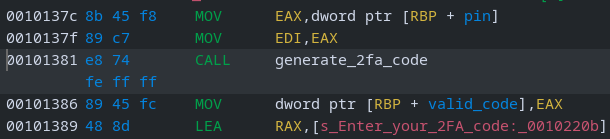

# Secure Bank

## Video walkthrough

[](https://youtu.be/d7fdWoYOGaw "Reversing an Insecure 2FA Generation Algorithm")

## Challenge Description

> Can you crack the bank?

## Solution

Players try to login to the secure bank but don't have the correct pin.



```bash
./secure_bank
****************************************
*         Welcome to SecureBank        *
*    Your trusted partner in security  *
****************************************

========================================
=   SecureBank Superadmin Login System =
========================================

Enter superadmin PIN: 1234
Access Denied! Incorrect PIN.
```



Checking the strings will uncover the plaintext flag (different for remote) but no pin.



```bash
strings -n 10 secure_bank

Access Granted! Welcome, Superadmin!
INTIGRITI{fake_flag}
Here is your flag: %s
Access Denied! Incorrect 2FA code.
Enter superadmin PIN:
Access Denied! Incorrect PIN.
Enter your 2FA code:
GCC: (Debian 12.2.0-14) 12.2.0
```



We could try a tool like `ltrace` to see if the pin comparison is displayed.



```bash
printf("Enter superadmin PIN: ")                                         = 22
__isoc99_scanf(0x55d5a141b1ea, 0x7ffe6418d938, 0, 0Enter superadmin PIN: 1234
)                     = 1
puts("Access Denied! Incorrect PIN."Access Denied! Incorrect PIN.
)                                    = 30
+++ exited (status 1) +++
```



Unfortunately, it is not. Let's check the decompiled code with `ghidra`.

### Static Analysis



```c
banner();
login_message();
printf("Enter superadmin PIN: ");
__isoc99_scanf(&%u,&pin);
if (pin == 1337) {
  valid_code = generate_2fa_code(1337);
  printf("Enter your 2FA code: ");
  __isoc99_scanf(&%u,&user_code);
  validate_2fa_code(user_code,valid_code);
}
else {
  puts("Access Denied! Incorrect PIN.");
}
return pin != 1337;
```



Classic `1337`, so predictable is almost unpredictable 🤔🧠



```bash
./secure_bank
****************************************
*         Welcome to SecureBank        *
*    Your trusted partner in security  *
****************************************

========================================
=   SecureBank Superadmin Login System =
========================================

Enter superadmin PIN: 1337
Enter your 2FA code: 1234
Access Denied! Incorrect 2FA code.
```



Checking the `generate_2fa_code` function, it looks a little complicated.



```c
local_10 = param_1 * 0xbeef;
local_c = local_10;
for (local_14 = 0; local_14 < 10; local_14 = local_14 + 1) {
  local_c = obscure_key(local_c);
  local_10 = ((local_10 ^ local_c) << 5 | (local_10 ^ local_c) >> 0x1b) +
             (local_c << ((char)local_14 + (char)(local_14 / 7) * -7 & 0x1fU) ^
             local_c >> ((char)local_14 + (char)(local_14 / 5) * -5 & 0x1fU));
}
return local_10 & 0xffffff;
```



Nothing that a little variable renaming can't fix!



```c
key = pin * 0xbeef;
code = key;
for (i = 0; i < 10; i = i + 1) {
  code = obscure_key(code);
  key = ((key ^ code) << 5 | (key ^ code) >> 27) +
        (code << ((char)i + (char)(i / 7) * -7 & 31U) ^
        code >> ((char)i + (char)(i / 5) * -5 & 31U));
}
return key & 0xffffff;
```



Much better! The `obscure_code` function is quite simple.



```c
return ((code ^ 0xa5a5a5a5) << 3 | (code ^ 0xa5a5a5a5) >> 29) * 0x1337 ^ 0x5a5a5a5a;
```



There's a lot of different ways to solve the challenge from here. One easy way might be to run the binary in a debugger like `gdb` (I like [pwndbg](https://github.com/pwndbg/pwndbg)) and set a breakpoint around the `generate_2f_code` function (or `validate_2fa_code`).

### Dynamic Analysis



Actually, we want to break right after the function (offset `0x1386`).



```bash
pwndbg> breakrva 0x1386
Breakpoint 1 at 0x555555555386
pwndbg> run

****************************************
*         Welcome to SecureBank        *
*    Your trusted partner in security  *
****************************************

========================================
=   SecureBank Superadmin Login System =
========================================

Enter superadmin PIN: 1337

Breakpoint 1, 0x0000555555555386 in main ()

─────────────────────────────────────────[ DISASM / x86-64 / set emulate on ]─────────────────────────────────────────
   0x555555555381 <main+112>    call   generate_2fa_code           <generate_2fa_code>

 ► 0x555555555386 <main+117>    mov    dword ptr [rbp - 4], eax     [0x7fffffffda8c] <= 0x568720
   0x555555555389 <main+120>    lea    rax, [rip + 0xe7b]           RAX => 0x55555555620b ◂— 'Enter your 2FA code: '
   0x555555555390 <main+127>    mov    rdi, rax                     RDI => 0x55555555620b ◂— 'Enter your 2FA code: '
   0x555555555393 <main+130>    mov    eax, 0                       EAX => 0
   0x555555555398 <main+135>    call   printf@plt                  <printf@plt>
```



See the value being moved from the EAX register onto the stack? `0x568720` in decimal is `5670688`, let's try it!



```bash
./secure_bank
****************************************
*         Welcome to SecureBank        *
*    Your trusted partner in security  *
****************************************

========================================
=   SecureBank Superadmin Login System =
========================================

Enter superadmin PIN: 1337
Enter your 2FA code: 5670688
Access Granted! Welcome, Superadmin!
Here is your flag: INTIGRITI{pffft_what_2fa?!}
```



### Solve.py

Another option is to make a solve script according to the decompiled code. I like to copy/paste from ghidra to ChatGPT and get a python script to run.



```python
def obscure_key(key):
    key ^= 0xA5A5A5A5
    # Make sure it stays within 32 bits
    key = (key << 3) & 0xFFFFFFFF | (key >> 29)
    key *= 0x1337
    key &= 0xFFFFFFFF  # Keep it within 32-bit unsigned integer bounds
    key ^= 0x5A5A5A5A
    return key

def generate_2fa_code(pin):
    key = pin * 0xBEEF
    key &= 0xFFFFFFFF  # Ensure it's 32-bit
    code = key

    for i in range(10):
        key = obscure_key(key)
        code ^= key
        code = (code << 5) & 0xFFFFFFFF | (
            code >> 27)  # Rotate and ensure 32 bits
        code += (key >> (i % 5)) ^ (key << (i % 7))
        code &= 0xFFFFFFFF  # Keep it within 32-bit unsigned integer bounds

    code &= 0xFFFFFF  # Ensure the 2FA code is 24 bits (6 digits)
    return code

if __name__ == "__main__":
    pin = 1337  # The superadmin PIN
    expected_code = generate_2fa_code(pin)
    print(f"Expected 2FA Code: {expected_code}")
```





```bash
python solve.py
Expected 2FA Code: 5670688
```



Flag: `INTIGRITI{pfff7_wh47_2f4?!}`
