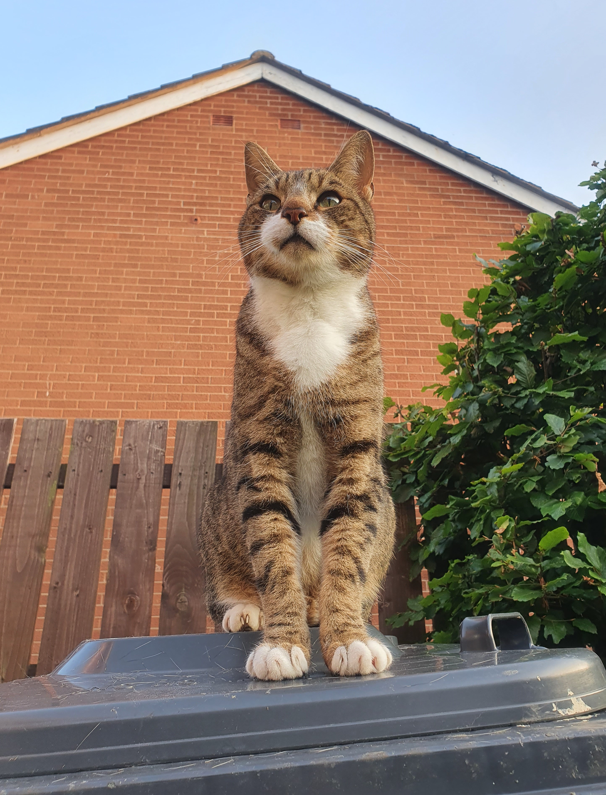

# In Plain Sight

## Challenge Description

> Barely hidden tbh..

## Solution

Players download an image of a cute cat (his name is Yang 💜).



Running a tool like `foremost` or `binwalk` will reveal an embedded file.



```bash
binwalk -e meow.jpg

DECIMAL       HEXADECIMAL     DESCRIPTION
--------------------------------------------------------------------------------
2144878       0x20BA6E        Zip archive data, encrypted at least v2.0 to extract, compressed size: 1938, uncompressed size: 3446, name: flag.png
2146976       0x20C2A0        End of Zip archive, footer length: 22
```



If we try to unzip the archive, we'll see it's encrypted.



```bash
unzip 20BA6E.zip
Archive:  20BA6E.zip
[20BA6E.zip] flag.png password:
```



Returning to the original JPG, check the strings.



```bash
strings -n 10 meow.jpg

)D8^FricdRr
Y'~>vfc]*.
YoullNeverGetThis719482
flag.pngUT
```



Try `YoullNeverGetThis719482` as a password.



```bash
unzip 20BA6E.zip
Archive:  20BA6E.zip
[20BA6E.zip] flag.png password:
replace flag.png? [y]es, [n]o, [A]ll, [N]one, [r]ename: y
  inflating: flag.png
```



Opening the image, it appears to be pure white.


However, if we open with MS paint (or alternative) and use the paint bucket (fill) tool, the flag will be revealed.


Flag: `INTIGRITI{w4rmup_fl46z}`
