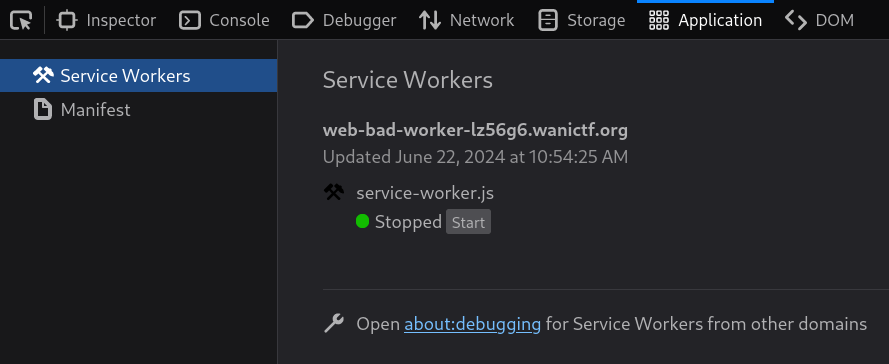
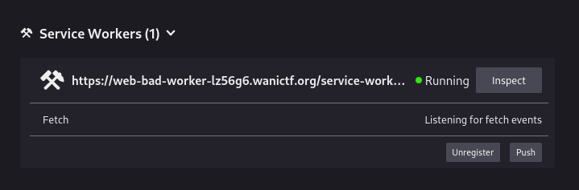
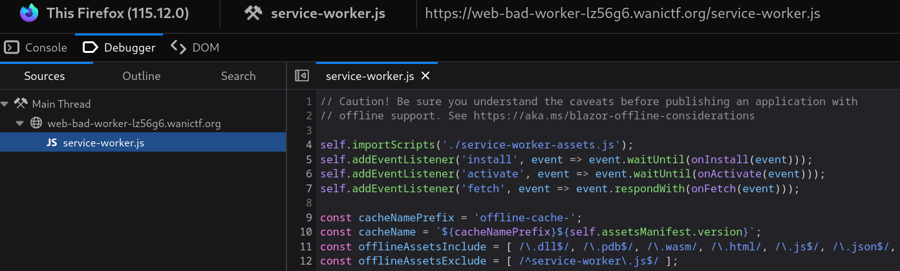
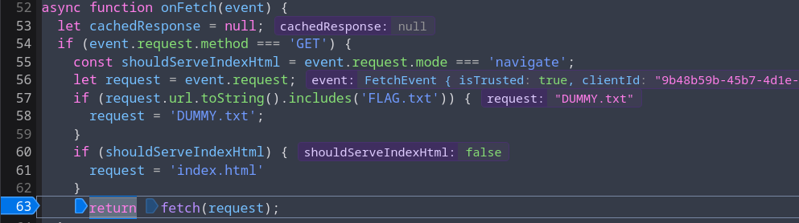
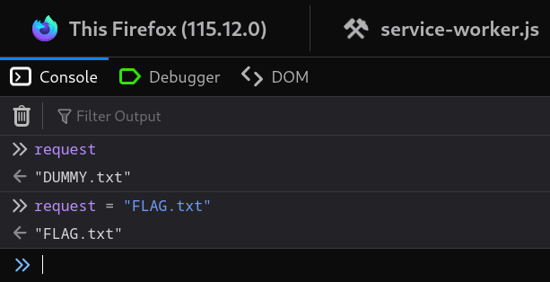
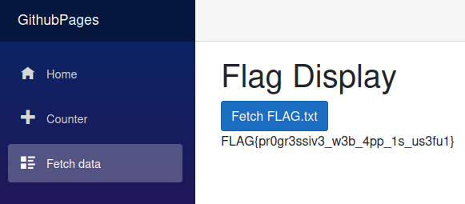

# Bad Worker

## Description

> We created a web application that works offline.

## Recon

GithubPages site with two endpoints; `/counter` and `/fetchdata`.

The counter page contains a button (`Click me`), which increments a counter.

The second endpoint has a button saying `Fetch FLAG.txt`. However, if we click the button, it returns `FLAG{This is not the flag!!}`.

## Solution

Checking the debugger (devtools), there is a folder `_framework` containing files like `blazor.webassembly.js` and `dotnet.wasm`.


```html
<script src="_framework/blazor.webassembly.js"></script>
<script>
    navigator.serviceWorker.register("service-worker.js");
</script>
```


I visited the `Application` tab and see the `service-worker.js` script is running.



It also says I should open `about:debugging` for some reason, so I do that 😃



When I click inspect, it allows me to view the service-worker.js source code.



Here's the interesting part.


```js
async function onFetch(event) {
    let cachedResponse = null;
    if (event.request.method === "GET") {
        const shouldServeIndexHtml = event.request.mode === "navigate";
        let request = event.request;
        if (request.url.toString().includes("FLAG.txt")) {
            request = "DUMMY.txt";
        }
        if (shouldServeIndexHtml) {
            request = "index.html";
        }
        return fetch(request);
    }

    return cachedResponse || fetch(event.request);
}
```


Thankfully, you don't need to be an expert in JavaScript to conclude that our request for "FLAG.txt" is being replaced with "DUMMY.txt".

I set a breakpoint at the following line.


```js
return fetch(request);
```


Notice that `request = "DUMMY.txt`, since it was changed on line 58.



I switch to the console and set `request` to "`FLAG.txt`"



Now, if we go back to the debugger and resume execution, we'll find that the correct flag was delivered to the webpage.



Flag: `FLAG{pr0gr3ssiv3_w3b_4pp_1s_us3fu1}`
