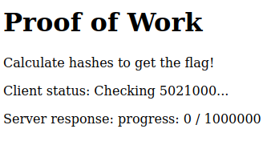
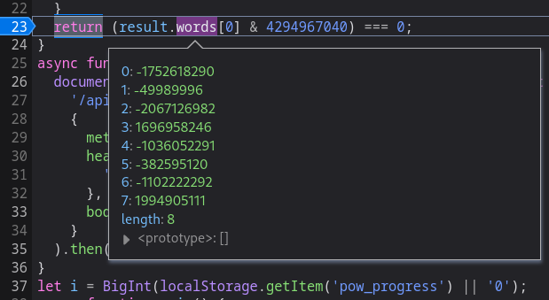
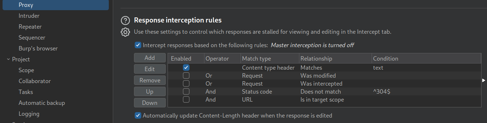
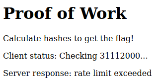
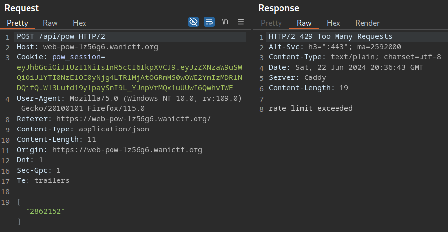
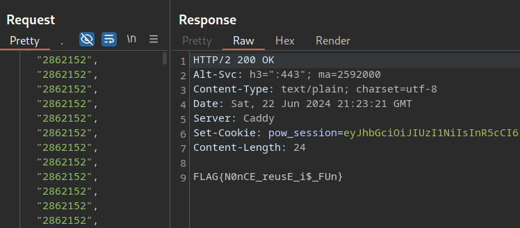

# PoW

## Description

> compute hash to get your flag

## Recon

Basic web page with an incrementing proof-of-work counter.



Our session is tracked via a cookie: `pow_session`. The local storage contains `pow_progress`, which continuously updates the `client status` value from the picture above.

## Source


```js
function hash(input) {
    let result = input;
    for (let i = 0; i < 10; i++) {
        result = CryptoJS.SHA256(result);
    }
    return (result.words[0] & 4294967040) === 0;
}
async function send(array) {
    document.getElementById("server-response").innerText = await fetch(
        "/api/pow",
        {
            method: "POST",
            headers: {
                "Content-Type": "application/json",
            },
            body: JSON.stringify(array),
        }
    ).then((r) => r.text());
}
let i = BigInt(localStorage.getItem("pow_progress") || "0");
async function main() {
    await send([]);
    async function loop() {
        document.getElementById(
            "client-status"
        ).innerText = `Checking ${i.toString()}...`;
        localStorage.setItem("pow_progress", i.toString());
        for (let j = 0; j < 1000; j++) {
            i++;
            if (hash(i.toString())) {
                await send([i.toString()]);
            }
        }
        requestAnimationFrame(loop);
    }
    loop();
}
main();
```


-   The script reads the PoW progress (int) from local storage (`i`)
-   It loops 1000 times, incrementing `i` and sending the value to a `hash` function
-   The `hash` function loops 10 times, iteratively hashing the input (sha256)
-   Note, `CryptoJS.SHA256` returns 8 \[32-bit\] words, like shown in the picture
-   The final line (AND) is a [masking](<https://en.wikipedia.org/wiki/Mask_(computing)>) operation - `4294967040` in hex is `0xFFFFFF00`
-   Basically, if the last 8 bits of the first word equals `0`, then we get 1 progress point



## Solution

I began by enabling interception of server responses in burp.



Now, if we reload the page, we can modify the JavaScript.

I found a valid value, e.g., `2862152`, and modified the script to repeatedly send it, skipping the hashing algorithm altogether.


```js
document.getElementById(
    "client-status"
).innerText = `Checking ${i.toString()}...`;
localStorage.setItem("pow_progress", i.toString());
for (let j = 0; j < 1000; j++) {
    i++;
    await send(["2862152".toString()]);
}
```


The progress increments at 1 per second; however, we quickly hit a rate limit.



We need to get a million points anyway, so this wasn't realistic (1,000,000 seconds is nearly 12 days 😆)

I quickly realised that the valid PoW's are sent as an array.



I decided to send two valid values at once, e.g.


```json
["2862152", "2862152"]
```


This increments the counter by 2! So we just need to make an array of 1 million 🧠


```js
var box = [];
for (let cat = 0; cat < 1000000; cat++) {
    box[cat] = "2862152";
}
console.log(box.toString());
```


Actually, don't do that unless you want to crash your browser 😂

Instead, let's do it 100,000 times, and then we can send 10 requests.


```js
var box = [];
for (let cat = 0; cat < 100000; cat++) {
    box[cat] = '"2862152"';
}
console.log(box.toString());
```


It's works! We repeat 10 times and get the flag 😌



Was this the intended solution? I'm not so sure..

Flag: `FLAG{N0nCE_reusE_i$_FUn}`
